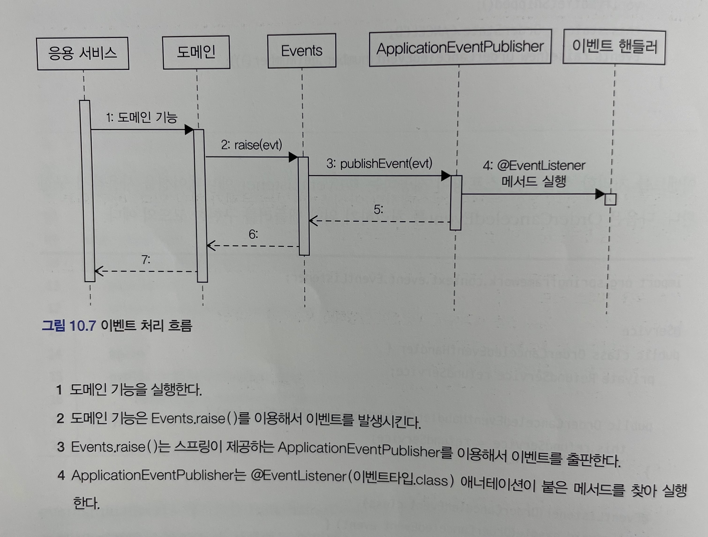

# 도메인 주도 개발 시작하기 : DDD 핵심 개념 정리부터 구현까지

- 정리 범위
  - Chapter 9 도메인 모델과 바운디드 컨텍스트 : 9.5
  - Chapter 10 이벤트 : 10.1 ~ 10.3

## 9. 도메인 모델과 바운디드 컨텍스트

### 9.5 바운디드 컨텍스트 간 관계

바운디드 컨텍스트는 어떤 식으로든 연결되기 때문에 두 바운디드 컨텍스트는 다양한 방식으로 관계를 맺는다.


- 상류 컴포넌트는 일종의 서비스 공급자 역할을 하며 하류 컴포넌트는 그 서비스를 사용하는 고객 역할을 한다.
- 고객과 공급자 관계에 있는 두 팀은 상호 협력이 필수적이다.
  - 상류 팀이 마음대로 API를 변경하면 하류 팀은 변경된 API에 맞추느라 우선순위가 높은 다른 기능을 개발하지 못할 수도 있다.
  - 반대로 상류 팀이 무언가를 변경할 때마다 하류 팀으로부터 여러 절차를 거쳐 승낙을 받아야 한다면 상류 팀은 새로운 개발 시도 자체를 하지 않을 수도 있다.
- 상류 팀과 하류 팀은 개발 계획을 서로 공유하고 일정을 협의해야 한다.
- 상류 컴포넌트는 보통 하류 컴포넌트가 사용할 수 있는 통신 프로토콜을 정의하고 이를 공개한다.
  - 상류 팀의 고객인 하류 팀이 다수 존재하면 상류 팀은 여러 하류 팀의 요구사항을 수용할 수 있는 API를 만들고 이를 서비스 형태로 공개해서 서비스의 일관성을 유지할 수 있다.
  - 이런 서비스를 가리켜 공개 호스트 서비스라고 한다.
    - 대표적인 예) 블로그, 카폐, 게시판과 같은 서비스

상류 컴포넌트의 서비스를 상류 바운디드 컨텍스트의 도메인 모델을 따른다. 따라서 하류 컴포넌트는 상류 서비스의 모델이 자신의 도메인 모델에 영향을 주지 않도록 보호해 주는 완충 지대를 만들어야 한다.


- `RecSystemClient` 는 외부 시스템과 연동을 처리하는데 외부 시스템의 도메인 모델이 내 도메인 모델을 침범하지 않도록 막아주는 역할을 한다. 
- 즉, 내 모델이 깨지는 것을 막아주는 안티코럽션 계층이 된다.
- 이 계층에서 두 바운디드 컨텍스트 간의 모델 변환을 처리해 주기 때문에 다른 바운디드 컨텍스트의 모델에 영향을 받지 않고 내 도메인 모델을 유지할 수 있다.

두 바운디드 컨텍스트가 같은 모델을 공유하는 경우도 있다.

- 두 팀이 공유하는 모델을 공유 커널이라고 한다.
- 공유 커널의 장점은 중복을 줄여준다는 것이다.
- 두 팀이 한 모델을 공유하기 때문에 한 팀에서 임의로 모델을 변경하면 안 되며 두 팀이 밀접한 관계를 유지해야 한다.

독립 방식 관계는 간단하다.

- 서로 통합하지 않는 방식이다.
- 두 바운디드 컨텍스트 간에 통합하지 않으므로 서로 독립적으로 모델을 발전시킨다.
- 두 바운디드 컨텍스트 간의 통합은 수동으로 이루어진다.


- 수동으로 통합하는 방식이 나쁜 것은 아니지만 규모가 커질수록 수동 통합에는 한계가 있으므로 규모가 커지기 시작하면 두 바운디드 컨텍스트를 통합해야 한다.

### 9.6 컨텍스트 맵

나무반 보고 숲을 보지 못하는 상황을 방지하려면 전체 비즈니스를 조망할 수 있는 지도가 필요한데 그것이 바로 컨텍스트 맵이다.


- 바운디드 컨텍스트 영역에 주요 애그리거트를 함께 표시하면 모델에 대한 관계가 더 명확히 드러난다.
- 컨텍스트 맵은 시스템의 전체 구조를 보여준다.
- 컨텍스트 맵을 그리는 규칙은 따로 없다.
  - 간단한 도형과 선을 이용
  - 화이트보드나 파워포인트와 같은 도구를 이용해 쉽게 그리는 것 가능
- 컨텍스트 맵은 전체 시스템의 이해 수준을 보여준다. 즉, 시스템을 더 잘 이해하거나 시간이 지나면서 컨텍스트 관계가 바뀌면 컨텍스트 맵도 함께 바뀐다.

## 10. 이벤트

### 10.1 시스템 간 강결합 문제


### 10.2 이벤트 개요

이벤트라는 용어는 `과거에 벌어진 어떤 것` 을 의미한다.

- 예를 들어 사용자가 암호를 변경한 것을 `암호를 변경했음 이벤트`가 벌어졌다고 할 수 있다.
- 비슷하게 주문을 취소했다면 `주문을 취소했음 이벤트` 가 발생했다고 할 수 있다.

#### 10.2.1 이벤트 관련 구성요소

도메인 모델에 이벤트를 도입하려면 이벤트 관련 구성요소인 이벤트, 이벤트 생성 주체, 이벤트 디스패치(퍼블리셔), 이벤트 핸들러(구독자) 구현해야 한다.


- 도메인 모델에서 이벤트 생성 주체는 엔티티, 밸류, 도메인 서비스와 같은 도메인 객체이다.
  - 이들 도메인 객체는 도메인 로직을 실행해서 상태가 바뀌면 관련 이벤트를 발생시킨다.
- 이벤트 핸들러는 이벤트 생성 주체가 발생한 이벤트에 반응한다.
  - 이벤트 핸들러는 생성 주체가 발생한 이벤트를 생성해서 디스패치에 이벤트를 전달한다.
- 이벤트 생성 주체와 이벤트 핸들러를 연결해 주는 것이 바로 이벤트 디스패치
  - 이벤트 생성 주체로부터 이벤트를 전달받고 해당 이벤트를 처리할 수 있는 핸들러에 이벤트를 전파한다.
  - 이벤트 디스패치의 구현 방식에 따라 이벤트 생성과 처리를 동기나 비동기로 실행하게 된다.

#### 10.2.2 이벤트의 구성

이벤트는 발생한 이벤트에 대한 정보를 담는다.

```java
public class ShippingInfoChangedEvent {
  
  private String orderNumber;
  private long timestamp;
  private ShippingInfo newShippingInfo;

  // 생성자, getter
}
```

- 클래스 이름을 보면 `Changed` 라는 과거 시제를 사용했다.
- 이벤트는 현재 기준으로 과거에 벌어진 것을 표현하기 때문에 이벤트 이름에는 과거 시제를 사용한다.


```java
public class Order {

  public void changeShippingInfo(ShippingInfo newShippingInfo) {
    verifyNotYetShipped();
    setShippingInfo(newShippingInfo);
    Event.rais(new ShippingInfoChangedEvent(number, newShippingInfo));
  }
  ...
}
```

- Order 애그리거트의 배송지 변경 기능을 구현한 메서드는 해당 코드처럼 배송지 정보를 변경한 뒤에 이 이벤트를 발생시킬 것이다.
- 이 코드의 `Event.raise()` 는 디스패치를 통해 이벤트를 전파하는 기능을 제공한다.

```java
public class ShippingInfoChangedHandler {

  @EventListener(ShippingInfoChangedEvent.class)
  public void handle(ShippingInfoChangedEvent evt) {
    shippingInfoSynchronizer.sync(
      evt.getOrderNumber(),
      evt.getNewShippingInfo());
  }
}
```

- `ShippingInfoChangedEvent` 를 처리하는 핸들러는 디스패치로부터 이벤트를 전달받아 필요한 작업을 수행한다.

이벤트는 이벤트 핸들러가 작업을 수행하는 데 필요한 데이터를 담아야 한다.

- 데이터가 부족하면 핸들러는 필요한 데이터를 읽기 위해 관련 API를 호출하거나 DB에 데이터를 직접 읽어와야 한다.

```java
public class ShippingInfoChangedHandler {

  @EventListener(ShippingInfoChangedEvent.class)
  public void handle(ShippingInfoChangedEvent evt) {
    // 이벤트가 필요한 데이터를 담고 있지 않으면,
    // 이벤트 핸들러는 리포지터리, 조회 API, 직접DB 접근 등의
    // 방식을 통해 필요한 데이터를 조회해야 한다.
    Order order = orderRepository.findById(evt.getOrderNo());
    shippingInfoSynchronizer.sync(
      order.getNumber().getValue(),
      order.getShippingInfo());
  }
}
```

#### 10.2.3 이벤트 용도

이벤트는 크게 두 가지 용도로 쓰인다.

- 첫 번째 용도는 트리거다.
  - 도메인의 상태가 바뀔때 다른 후처리가 필요하면 후처리를 실행하기 위한 트리거로 이벤트를 사용할 수 있다.


- 두 번째 용도는 서로 다른 시스템 간의 데이터 동기화이다.

#### 10.2.4 이벤트 장점

이벤트를 사용하면 서로 다른 도메인 로직이 섞이는 것을 방지할 수 있다.


- 이벤트를 사용하여 주문 도메인에서 결제(환불) 도메인으로의 의존을 제거했다.

이벤트 핸들러를 사용하면 기능 확장도 용이하다.

- 구매 취소 시 환불과 함께 이메일로 취소 내용을 보내고 싶다면 이메일 발송을 처리하는 핸들러를 구현하면 된다.


### 10.3 이벤트, 핸들러, 디스패처 구현

- 이벤트 클래스 : 이벤트를 표현한다.
- 디스패처 : 스프링이 제공하는 ApplicationEventPublisher를 이용한다.
- Events : 이벤트를 발행한다. 이벤트 발행을 위해 ApplicationEventPublisher를 사용한다.
- 이벤트 핸들러 : 이벤트를 수신해서 처리한다. 스프링이 제공하는 기능을 사용한다.

이벤트 디스패처를 직접 구현할 수도 있지만, 이 책에서는 스프링이 제공하는 이벤트 관련 기능을 사용해서 이벤트 발생과 처리를 구현한다.

#### 10.3.1 이벤트 클래스

이벤트 자체를 위한 상위 타입은 존재하지 않는다. 원하는 클래스를 이벤트로 사용하면 된다.
이벤트는 과거에 벌어진 상태 변화나 사건을 의미하므로 이벤트 클래스의 이름을 결정할 때에는 과거 시제를 사용해야 한다는 점만 유의하면 된다.

이벤트 구성에서 설명한 것처럼 이벤트 클래스는 이벤트를 처리하는 데 필요한 최소한의 데이터를 포함해야 한다.

```java
public class OrderCanceledEvent {
  // 이벤트는 핸들러에서 이벤트를 처리하는 데 필요한 데이터를 포함한다.
  private String orderNumber;

  public OrderCanceledEvent(String number) {
    this.orderNumber = number;
  }

  public String getOrderNumber() {
    return orderNumber;
  }
}
```

모든 이벤트가 공통으로 갖는 프로퍼티가 존재한다면 관련 상위 클래스를 만들 수도 있다.

```java
public abstract class Event {
  private long timestamp;

  public Event() {
    this.timestamp = System.currentTimeMillis();
  }

  public long getTimestamp() {
    return timestamp;
  }
}
```

- 이제 발생 시간이 필요한 이벤트 클래스는 Event 클래스를 상속받아 구현하면 된다.

```java
// 발생 시간이 필요한 각 이벤트 클래스는 Event를 상속받아 구현한다.
public class OrderCanceledEvent extends Event {
  private String orderNumber;

  public OrderCanceledEvent(String number) {
    super();
    this.orderNumber = number;
  }
}
```

#### 10.3.2 Events 클래스와 ApplicationEventPublisher

이벤트 발생과 출판을 위해 스프링이 제공하는 ApplicationEventPublisher를 사용한다.

```java
public class Events {
  private static ApplicationEventPublisher publisher;

  static void setPublisher(ApplicationEventPublisher publisher) {
    Events.publisher = publisher;
  }

  public static void raise(Object event) {
    if (publisher != null) {
      publisher.publishEvent(event);
    }
  }
}
```

- Events 클래스의 raise() 메서드는 ApplicationEventPublisher가 제공하는 publishEvent() 메서드를 이용해서 발생시킨다.
- Events 클래스가 사용할 ApplicationEvent Publisher 객체는 setPublisher() 메서드를 통해서 전달받는다.
- Events#setPublisher() 메서드에 이벤트 퍼블리셔를 전달하기 위해 스프링 설정 클래스를 작성한다.

```java
@Configuration
public class EventsConfiguration {
  @Autowired
  private ApplicationContext applicationContext;

  @Bean
  public InitializingBean eventsInitializer() {
    return () -> Events.setPublisher(applicationContext);
  }
}
```

- eventsInitializer() 메서드는 InitializingBean 타입 객체를 빈으로 설정한다.
- 이 타입은 스프링 빈 객체를 초기화할 때 사용하는 인터페이스로, 이 기능을 사용해서 Events 클래스를 초기화했다.
- ApplicationContext는 ApplicationEventPublisher를 상속하고 있으므로 Events 클래스를 초기화할 때 ApplicationContext를 전달했다.

#### 10.3.3 이벤트 발생과 이벤트 핸들러

이벤트를 발생시킬 코드는 Events.raise() 메서드를 사용한다.

```java
public class Order {
  public void cancel() {
    verifyNotYetShipped();
    this.state = OrderState.CANCELED;
    Events.raise(new OrderCanceledEvent(number.getNumber()));
  }
}
```

- 이벤트를 처리할 핸들러는 스프링이 제공하는 @EventListener 애너테이션을 사용해서 구현한다.

```java
@Service
public class OrderCanceledEventHandler {
  private RefundService refundService;

  public OrderCanceledEventHandler(RefundService refundService) {
    this.refundService = refundService;
  }

  @EventListener(OrderCanceledEvent.class)
  public void handle(OrderCanceledEvent event) {
    refundService.refund(event.getOrderNumber());
  }
}
```

- ApplicationEventPublisher#publishEvent() 메서드를 실행할 때 OrderCanceledEvent 타입 객체를 전달하면, OrderCanceledEvent.class 값을 갖는 @EventListener 애너테이션을 붙인 메서드를 찾아 실행한다.


#### 10.3.4 흐름 정리



코드 흐름을 보면 응용 서비스와 동일한 트랜잭션 범위에서 이벤트 핸들러를 실행하고 있다. 즉, 도메인 상태 변경과 이벤트 핸들러는 같은 트랜잭션 범위에서 실행한다.