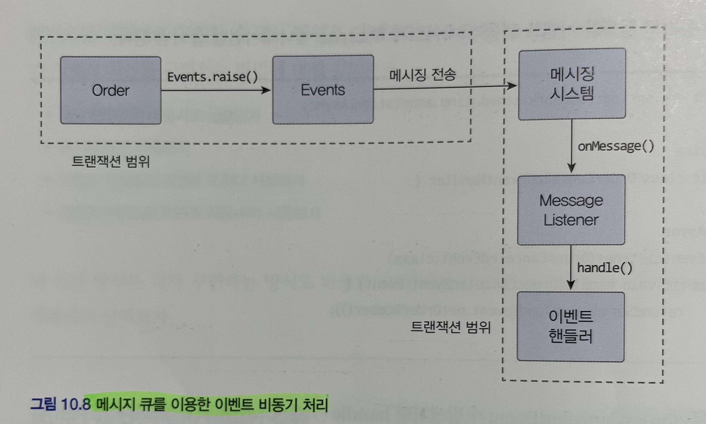
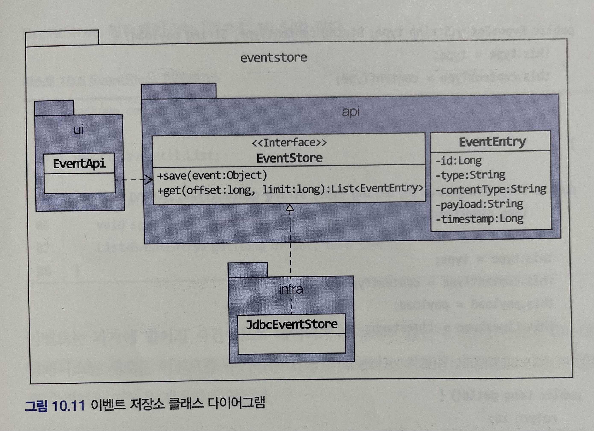

# 도메인 주도 개발 시작하기 : DDD 핵심 개념 정리부터 구현까지

- 정리 범위
  - Chapter 10 이벤트 : 10.4 ~ 10.5

## 10. 이벤트

### 10.4 동기 이벤트 처리 문제

이벤트를 사용해서 강결합 문제는 해소했지만 아직 남아 있는 문제가 하나 있다.

- 외부 서비스에 영향을 받는 문제

```java
// 1. 응용 서비스 코드
@Transactional // 외부 연동 과정에서 익셉션이 발생하면 트랜잭션 처리는?
public void cancel(final OrderNo orderNo) {
    Order order = findOrder(orderNo);
    order.cancel(); // order.cancel()에서 OrderCanceldEvent 발생
}

@Service
public class OrderCanceldEventHandler {

    @EventListener(OrderCanceldEvent.class)
    public void handle(final OrderCanceldEvent event) {
        // refundService.refund() 가 느려지거나 익셉션이 발생하면?
        refundService.refund(event.getOrderNumber());
    }
}
```

- `refundService.refund()` 가 외부 환불 서비스와 연동한다고 가정
- 외부 환불 기능이 갑자기 느려지면 `cancel()` 메서드도 함께 느려짐
- 이것은 외부 서비스의 성능 저하가 바로 내 시스템의 성능 저하로 연결된다는 것을 의미

성능 저하뿐만 아니라 트랜잭션도 문제가 된다.

- `refundService.refund()` 익셉션 발생하면 `cancel()` 메서드의 트랜잭션을 롤백해야 할까?
- 트랜잭션 롤백하면 구매 취소 기능 -> 구매 취소 실패

외부 환불 서비스 실행에 실패했다고 해서 트랜잭션 롤백을 해야 할까?

- 구매 취소 자체는 처리하고 환불만 재처리하거나 수동으로 처리

외부 시스템과의 연동을 동기로 처리할 때 발생하는 성능과 트랜잭션 범위 문제를 해소하는 방법은 이벤트를 비동기로 처리하거나 이벤트와 트랜잭션을 연계하는 것이다.

### 10.5 비동기 이벤트 처리

##### 비동기 이벤트의 예시

- 회원가입 신청 시 검증을 위한 이메일 전송
- 검증 이메일이 바로 전송될 필요는 없으며, 10~20초 후에 도착해도 되고 받지 못했다면 다시 보내는 기능을 이용하면 된다.

##### 우리가 구현해야할 것

- `A 하면 이어서 B 하라` 는 내용을 담고 있는 요구사항은 실제 `A 하면 최대 언제까지 B 하라` 인 경우가 많다.
- 일정 시간 안에만 후속 조치를 처리하면 되는 경우가 적지 않다.

##### 이벤트

- `A 하면 일정 시간 안에 B 하라` 는 요구사항에서 `A 하면`의 경우

###### 비동기 이벤트의 경우

- `A 하면 최대 안제까지 B 하라` 로 변경할 수 있는 요구사항
- 이벤트가 발생하면 별도 스레드로 B를 수행하는 핸들러를 실행하는 방식

###### 비동기로 구현할 수 있는 방법

- 로컬 핸들러를 비동기로 실행하기
- 메시지 큐를 사용하기
- 이벤트 저장소와 이벤트 포워더 사용하기
- 이벤트 저장소와 이벤트 제공 API 사용하기

#### 10.5.1 로컬 핸들러 비동기 실행

이벤트 핸들러를 별도 스레드로 실행하는 것
스프링이 제공하는 `@Async` 애너테이션을 사용하면 손쉽게 비동기로 이벤트 핸들러를 실행할 수 있다.

- `@EnableAsync` 애너테이션을 사용해서 비동기 기능을 활성화한다.

```java
@SpringBootApplication
@EnableAsync
public class ShopApplication {

    public static void main(String[] args) {
        SpringApplication.run(ShopApplication.class, args);
    }
}
```

- 이벤트 핸들러 메서드에 `@Async` 애너테이션을 붙인다.

```java
@Service
public class OrderCancelEventHadler {

    @Async
    @EventListener(OrderCanceledEventHadler.class)
    public void handle(OrderCanceledEvent event) {
        refundService.refund(event.getOrderNumber());
    }
}
```

스프링은 OrderCanceledEvent 가 발생하면 handle() 메서드를 별도 스레드를 이용해서 비동기로 실행한다.

#### 10.5.2 메시징 시스템을 이용한 비동기 구현

비동기로 이벤트를 처리해야 할 때 사용하는 또 다른 방법

- 카프카나 래빗MQ와 같은 메시징 시스템을 사용



필요하다면 이벤트를 발생시키는 도메인 기능과 큐에 이벤트를 저장하는 절차를 한 트랜잭션으로 묶어야 한다.

- 도메인 기능 실행 결과를 DB에 반영
- 과정에서 발생한 이벤트를 메시지 큐에 저장하는 것

위와 같이 트랜잭션 범위에서 실행하려면 글로벌 트랜잭션이 필요하다.

##### 글로벌 트랜잭션

장점으로는, 

- 안전하게 이벤트를 메시지 큐에 전달 가능

단점으로는,

- 전체 성능이 떨어질 수 있음
- 지원하지 않는 메시징 시스템도 있음

##### 별도 이벤트 핸들러

메시지 큐를 사용하면 보통 이벤트를 발생시키는 주체와 이벤트 핸들러가 별도 프로세스에서 동작

- 이벤트 발생 JVM과 처리 JVM이 다르다는 것을 의미
- 한 JVM에서 이벤트 발생 주체와 이벤트 핸들러가 메시지 큐를 이용해서 이벤트를 주도 받을 수 있음
- 동일 JVM에서 비동기 처리를 위해 메시지 큐를 사용하는 것은 시스템을 복잡하게 만들 수 있음

##### 메시징 시스템

래빗MQ

- 글로벌 트랜잭션 지원
- 클러스터와 고가용성을 지원하여 안정적으로 메시지 전달 가능
- 다양한 개발 언어와 통신 프로토콜 지원

카프카

- 글로벌 트랜잭션 미지원
- 다른 메시징 시스템에 비해 높은 성능

#### 10.5.3 이벤트 저장소를 이용한 비동기 처리

이벤트를 비동기로 처리하는 또 다른 방법

- 이벤트를 DB에 저장
- 이벤트를 외부에 제공하는 API 사용

##### DB에 저장

이벤트를 일단 DB에 저장한 뒤에 별도 프로그램을 이용해서 이벤트 핸들러에 전달하는 것이다.


- 이벤트가 발생하면 핸들러는 스토리지에 이벤트를 저장
- 포워더는 주기적으로 이벤트 저장소에서 이벤트를 가져와 이벤트 핸들러를 실행
- 포워더는 별도 스레드를 이용하기 때문에 이벤트 발행과 처리가 비동기로 처리

위 방식은 도메인의 상태와 이벤트 저장소로 동일한 DB를 사용한다.
즉, 도메인의 상태 변화와 이벤트 저장이 로컬 트랜잭션으로 처리된다.
이벤트를 물리적 저장소에 보관하기 때문에 핸들러가 이벤트 처리에 실패할 경우 포워더는 다시 이벤트 저장소에서 이벤트를 읽어와 핸들러를 실행하면 된다.

##### 외부 API 사용


API 방식과 포워더 방식의 차이점은 이벤트를 전달하는 방식

- 포워더 방식이 포워더를 이용해서 이벤트를 외부에 전달한다.
- 포워더 방식은 이벤트를 어디까지 처리했는지 추적하는 역할이 포워더에 있다.
- API 방식은 외부 핸들러가 API 서버를 통해 이벤트 목록을 가져간다.
- API 방식에서는 이벤트 목록을 요구하는 외부 핸들러가 자신이 어디까지 이벤트를 처리했는지 기억해야 한다.

##### 이벤트 저장소 구현

포워더 방식과 API 방식 모두 이벤트 저장소를 사용하므로 이벤트를 저장할 저장소가 필요하다.



- EventEntry
  - 이벤트 저장소에 보관할 데이터
  - 이벤트를 식별하기 위한 id, 이벤트 타입인 type, 직렬화한 데이터 형식인 contentType, 이벤트 데이터 자체인 payload, 이벤트 시간인 timestamp를 갖는다.
- EventStore
  - 이벤트를 저장하고 조회하는 인터페이스를 제공
- JdbcEventStore
  - JDBC를 이용한 EventStore 구현 클래스
- EventApi
  - REST API를 이용해서 이벤트 목록을 제공하는 컨트롤러

###### EventEntity 클래스

```java
public class EventEntry {
    private Long id;
    private String type;
    private String contentType;
    private String payload;
    private long timestamp;

    public EventEntry(String type, String contentType, String payload) {
        this.type = type;
        this.contentType = contentType;
        this.payload = payload;
        this.timestamp = System.currentTimeMillis();
    }

    public EventEntry(Long id, String type, String contentType, String payload,
                      long timestamp) {
        this.id = id;
        this.type = type;
        this.contentType = contentType;
        this.payload = payload;
        this.timestamp = timestamp;
    }

    public Long getId() {
        return id;
    }

    public String getType() {
        return type;
    }

    public String getContentType() {
        return contentType;
    }

    public String getPayload() {
        return payload;
    }

    public long getTimestamp() {
        return timestamp;
    }
}
```

###### EvenStore 인터페이스

- 이벤트 객체를 직렬화해서 payload에 저장

```java
public interface EventStore {
    void save(Object event);

    List<EventEntry> get(long offset, long limit);
}
```

- 이벤트를 과거에 벌어진 사건이므로 데이터가 변하지 않음
- EventStore 인터페이스는 새로운 이벤트를 추가하는 기능과 조회하는 기능만 제공하고 기존 이벤트 데이터를 수정하는 기능을 제공하지 않음

###### EventStore 인터페이스를 구현한 JdbcEventStore

```java
@Component
public class JdbcEventStore implements EventStore {
    private ObjectMapper objectMapper;
    private JdbcTemplate jdbcTemplate;

    public JdbcEventStore(ObjectMapper objectMapper, JdbcTemplate jdbcTemplate) {
        this.objectMapper = objectMapper;
        this.jdbcTemplate = jdbcTemplate;
    }

    @Override
    public void save(Object event) {
        EventEntry entry = new EventEntry(event.getClass().getName(),
                "application/json", toJson(event));
        jdbcTemplate.update(
                "insert into evententry " +
                        "(type, content_type, payload, timestamp) " +
                        "values (?, ?, ?, ?)",
                ps -> {
                    ps.setString(1, entry.getType());
                    ps.setString(2, entry.getContentType());
                    ps.setString(3, entry.getPayload());
                    ps.setTimestamp(4, new Timestamp(entry.getTimestamp()));
                });
    }

    private String toJson(Object event) {
        try {
            return objectMapper.writeValueAsString(event);
        } catch (JsonProcessingException e) {
            throw new PayloadConvertException(e);
        }
    }

    @Override
    public List<EventEntry> get(long offset, long limit) {
        return jdbcTemplate.query(
                "select * from evententry order by id asc limit ?, ?",
                ps -> {
                    ps.setLong(1, offset);
                    ps.setLong(2, limit);
                },
                (rs, rowNum) -> {
                    return new EventEntry(
                            rs.getLong("id"),
                            rs.getString("type"),
                            rs.getString("content_type"),
                            rs.getString("payload"),
                            rs.getTimestamp("timestamp").getTime());
                });
    }
}
```

- 구현 내용은 생략

EventEntry 를 저장할 evententry 테이블 DDL

```sql
create table evententry (
    id int not null AUTO_INCREMENT PRIMARY KEY,
    `type` varchar(255),
    `content_type` varchar(255),
    payload MEDIUMTEXT,
    `timestamp` datetime
) character set utf8mb4;
```

###### 이벤트 저장을 위한 이벤트 핸들러 구현

- 이벤트 저장소를 위한 기반이 되는 클래스는 모두 구현
- 이벤트 저장소에 추가하는 이벤트 핸들러를 구현하는 것

```java
@Component
public class EventStoreHandler {
    private EventStore eventStore;

    public EventStoreHandler(EventStore eventStore) {
        this.eventStore = eventStore;
    }

    @EventListener(Event.class)
    public void handle(Event event) {
        eventStore.save(event);
    }
}
```

- `handle()` 메서드는 `eventStore.save()` 메서드를 이용해서 이벤트 객체를 저장
- `@EventListener` 애너테이션은 값으로 Event.class을 갖으며, Event 타입을 상속받은 이벤트 타입만 이벤트 저장소에 보관하기 위한 것

##### REST API 구현

- offset과 limit의 웹 요청 파라미터를 이용해서 실행하고 그 결과를 JSON으로 리턴

###### EventApi 클래스

```java
@RestController
public class EventApi {
    private EventStore eventStore;

    public EventApi(EventStore eventStore) {
        this.eventStore = eventStore;
    }

    @RequestMapping(value = "/api/events", method = RequestMethod.GET)
    public List<EventEntry> list(
            @RequestParam("offset") Long offset,
            @RequestParam("limit") Long limit) {
        return eventStore.get(offset, limit);
    }
}
```


API를 사용하는 클라이언트는 일정 간격으로 다음 실행

- 가장 마지막에 처리한 데이터의 offset인 lastOffset을 구한다.
  - 저장한 lastOffset이 없으면 0을 사용한다.
- 마지막에 처리한 lastOffset을 offset으로 사용해서 API를 실행한다.
- API 결과로 받은 데이터를 처리한다.
- offset + 데이터 개수를 lastOffset으로 저장한다.

그럼, 왜 마지막 처리한 오프셋을 저장해야 할까?

- 같은 이벤트를 중복해서 처리하지 않기 위해서


클라이언트는 API를 이용해서 언제든지 원하는 이벤트를 가져올 수 있기 때문에 이벤트 처리에 실패하면 다시 실패한 이벤트로부터 읽어와 이벤트를 재처리할 수 있다.
API 서버에 장애가 발생한 경우에도 주기적으로 재시도를 해서 API 서버가 살아나면 이벤트를 처리할 수 있다.

##### 포워더 구현

- API 방식의 클라이언트 구현과 유사

포워더는 일정 주기로 EventStore에서 이벤트를 읽어와 이벤트 핸들러에 전달하며 된다.

- API 방식과 마찬가지로 마지막으로 전달한 이벤트의 offset을 다음 조회 시점에 마지막으로 처리한 offset부터 이벤트를 가져오면 된다.

###### EventForwarder 클래스

```java
@Component
public class EventForwarder {
    private static final int DEFAULT_LIMIT_SIZE = 100;

    private EventStore eventStore;
    private OffsetStore offsetStore;
    private EventSender eventSender;
    private int limitSize = DEFAULT_LIMIT_SIZE;

    public EventForwarder(EventStore eventStore,
                          OffsetStore offsetStore,
                          EventSender eventSender) {
        this.eventStore = eventStore;
        this.offsetStore = offsetStore;
        this.eventSender = eventSender;
    }

    // 메소드를 주기적으로 실행하기 위한 스케줄 설정
    @Scheduled(initialDelay = 1000L, fixedDelay = 1000L)
    public void getAndSend() {
        // 읽어올 이벤트의 다음 offset을 구한다
        long nextOffset = getNextOffset();
        // 이벤트 저장소에서 offset부터 limitSize 만큼 이벤트
        List<EventEntry> events = eventStore.get(nextOffset, limitSize);
        // 구한 이벤트가 존재하는지 검사한다.
        if (!events.isEmpty()) {
            // 구한 이벤트가 존재하면 sendEvent() 메서드를 이용해서 이벤트를 전송한다. sendEvent() 메서드는 처리한 이벤트 개수를 리턴한다.
            int processedCount = sendEvent(events);
            // 처리한 이벤트 개수가 0보다 크면 다음에 읽어올 offset을 저장한다.
            if (processedCount > 0) {
                saveNextOffset(nextOffset + processedCount);
            }
        }
    }

    private long getNextOffset() {
        return offsetStore.get();
    }

    private int sendEvent(List<EventEntry> events) {
        int processedCount = 0;
        try {
            for (EventEntry entry : events) {
                eventSender.send(entry);
                processedCount++;
            }
        } catch(Exception ex) {
            // 로깅 처리
        }
        return processedCount;
    }

    private void saveNextOffset(long nextOffset) {
        offsetStore.update(nextOffset);
    }
}
```

###### OffsetStore 클래스

```java
public interface OffsetStore {
    long get();
    void update(long nextOffset);
}
```

- offset 값을 DB 테이블에 저장하거나 로컬 파일에 보관해서 마지막 offset 값을 물리적 저장소에 보관

###### EventSender 클래스

```java
public interface EventSender {
    void send(EventEntry event);
}
```

- 외부 메시징 시스템에 이벤트를 전송하거나 원하는 핸들러에 이벤트를 전달
- 이벤트 처리 중에 익셉션이 발생하면 그대로 전파해서 다음 주기에 `getAndSend()` 메서드를 실행할 때 재처리할 수 있음