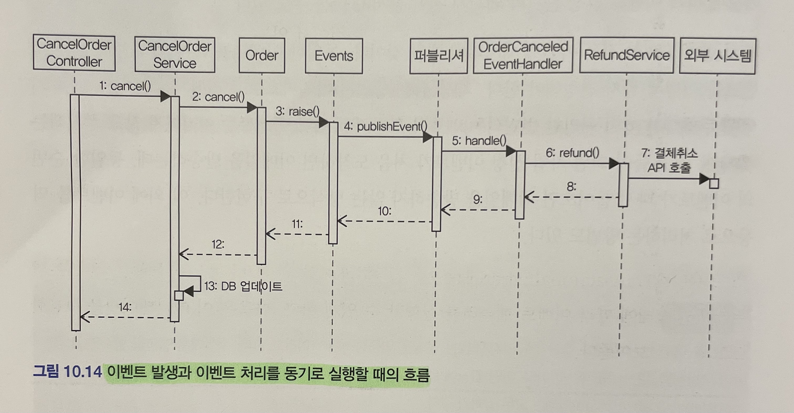
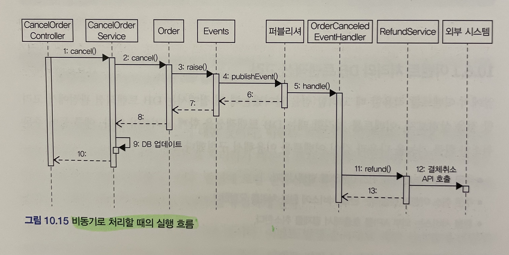
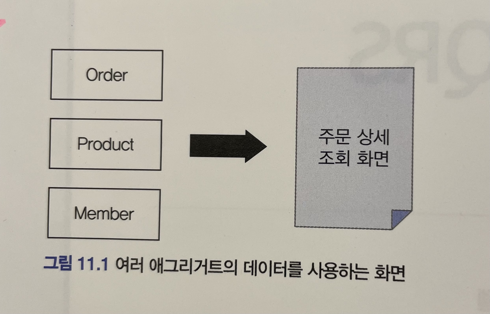
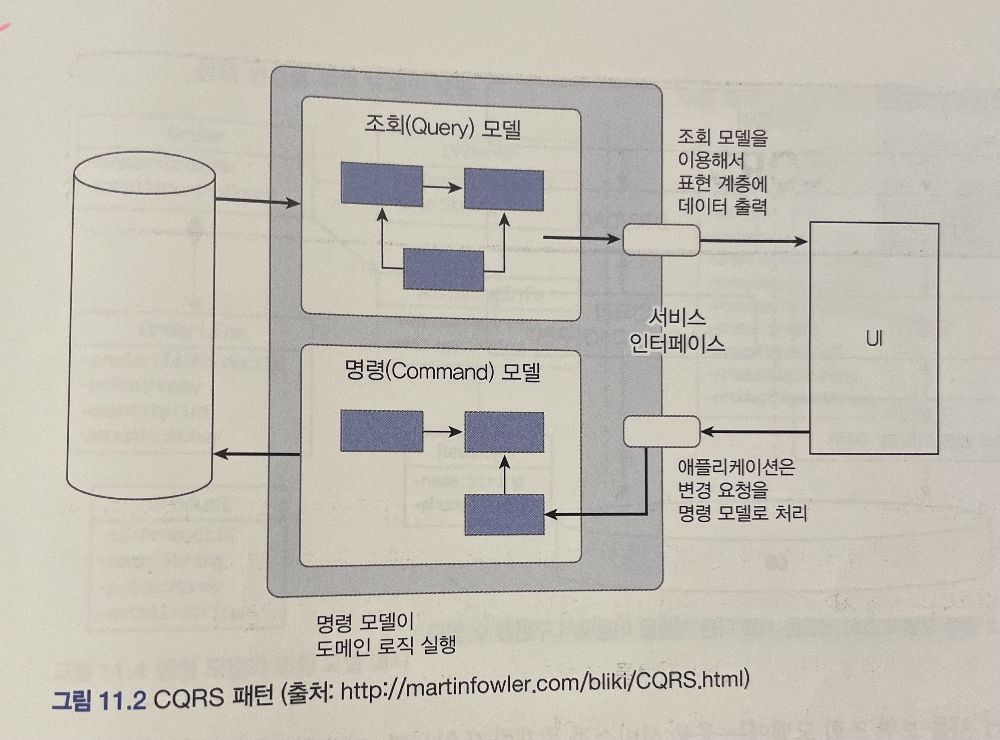
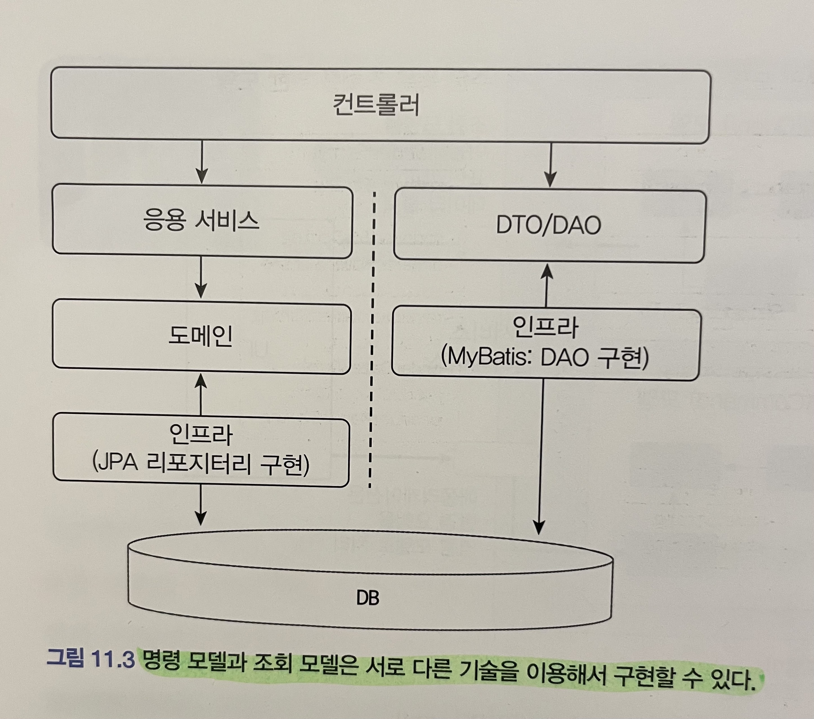
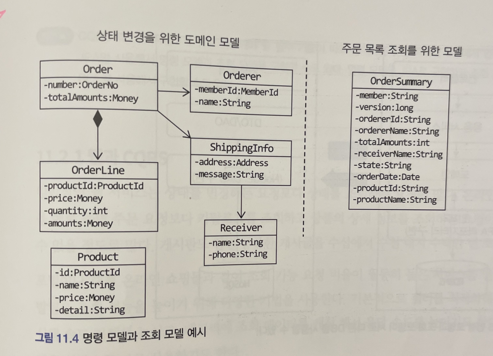
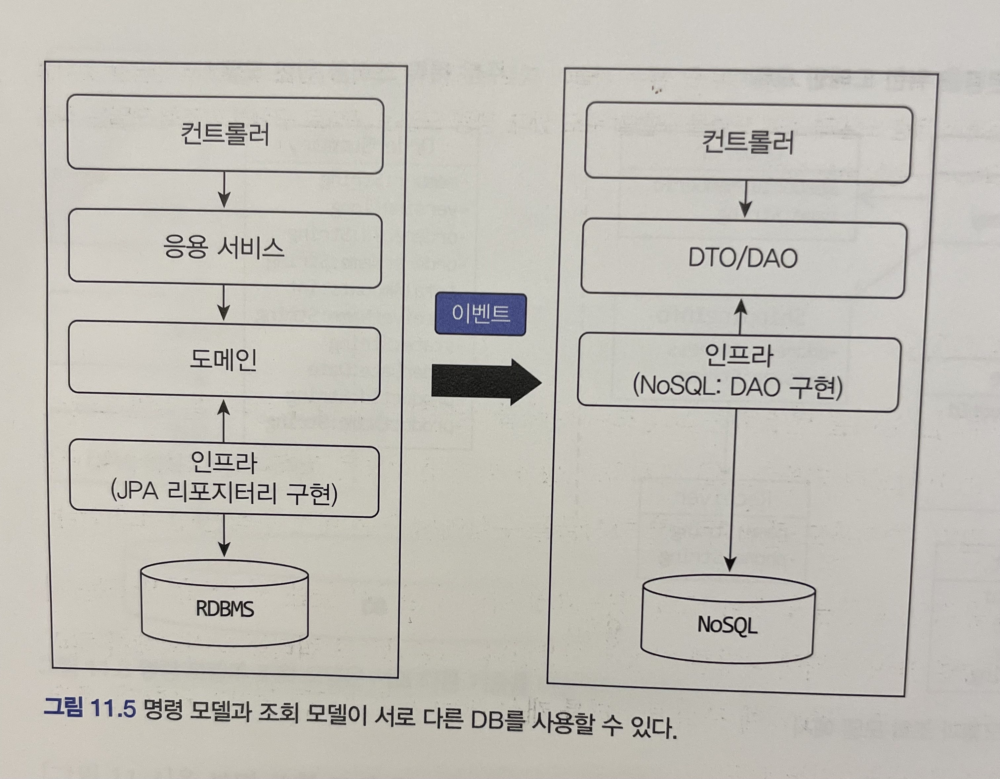

# 도메인 주도 개발 시작하기 : DDD 핵심 개념 정리부터 구현까지

- 정리 범위
  - Chapter 10 이벤트 : 10.6
  - Chapter 11 CQRS : 11.1 ~ 11.2

## 10. 이벤트

### 10.6 이벤트 적용 시 추가 고려 사항

이벤트를 구현할 때 추가로 고려할 점

- 이벤트 소스를 `EventEntry` 에 추가 여부
- 포워더에서 전송 실패를 얼마나 허용할 것인지 여부
- 이벤트 손실
- 이벤트 순서
- 이벤트 재처리

#### 이벤트 소스를 `EventEntry` 에 추가 여부

- 앞서 구현한 `EventEntry` 는 이벤트 발생 주체에 대한 정보를 갖지 않음
- `Order 가 발생시킨 이벤트만 조회하기` 처럼 특정 주제가 발생시킨 이벤트만 조회하는 기능을 구현할 수 없음
- 이 기능을 구현하려면 이벤트에 발생 주체 정보를 추가해야 함

#### 포워더에서 전송 실패를 얼마나 허용할 것인지 여부

- 포워더는 이벤트 전송에 실패하면 실패한 이벤트부터 다시 읽어와 전송을 시도한다.
- 특정 이벤트에서 계속 전송에 실패하면 어떻게 될까?
  - 실패한 이벤트로 인한 나머지 이벤트 전송 처리 문제 발생한다.
- 포워더를 구현할 때는 실패한 이벤트의 재전송 횟수 제한을 두어야 한다.

#### 이벤트 손실

- 이벤트 저장소를 사용하는 방식은 이벤트 발생과 이벤트 저장을 한 트랜잭션으로 처리한다
  - 트랜잭션에 성공하면 이벤트가 저장소에 보관된다는 것을 보장할 수 있다.
- 로컬 핸들러를 이용해서 이벤트를 비동기 처리할 경우 이벤트 처리에 실패하면 이벤트를 유실하게 된다.

#### 이벤트 순서

- 이벤트 발생 순서대로 외부 시스템에 전달해야 할 경우, 이벤트 저장소를 사용하는 것이 좋다.
  - 이벤트 저장소는 저장소에 이벤트를 발생 순서대로 저장하고 그 순서대로 이벤트 목록을 제공하기 때문이다.
- 메시징 시스템은 사용 기술에 따라 이벤트 발생 순서와 메시지 전달 순서가 다를 수도 있다.

#### 이벤트 재처리

- 동일한 이벤트를 다시 처리해야 할 때 이벤트를 어떻게 할지 결정해야 한다.
  - 가장 쉬운 방법은 마지막으로 처리한 이벤트의 순번을 기억해 두었다가 이미 처리한 순번의 이벤트가 도착하면 해당 이벤트를 처리하지 않고 무시하는 것이다.
  - 멱등성 처리
    - 연산을 여러 번 적용해도 결과가 달라지지 않은 성질
    - 이벤트 핸들러가 멱등성을 가지면 시스템 장애로 인해 같은 이벤트가 중복해서 발생해도 결과적으로 동일 상태가 되어서 이벤트 중복 발생이나 중복 처리에 대한 부담을 줄여준다.

#### 10.6.1 이벤트 처리와 DB 트랜잭션 고려

이벤트를 처리할 때는 DB 트랜잭션을 함께 고려해야 한다.

예를 들어,

- 주문 취소 기능을 주문 취소 이벤트를 발생시킨다.
- 주문 취소 이벤트 핸들러는 환불 서비스에 환불 처리를 요청한다.
- 환불 서비스는 외부 API를 호출해서 결제를 취소한다.

이벤트 발생과 처리를 모두 동기로 처리하면 다음과 같다.



- 고민이 필요한 부분
  - 12번 과정까지 성공하고 13번 과정에서 DB 업데이트가 실패하는 상황
  - 결제는 취소, 주문은 취소되지 않은 상태

이벤트를 비동기로 처리할 때도 DB 트랜잭션을 고려해야 한다.



- 이벤트 핸들러를 호출하는 5번 과정은 비동기 실행
- DB 업데이트와 트랜잭션을 다 커밋한 뒤에 환불 로직인 11 ~ 13번 과정을 실행
- 만약 12번 과정에서 외부 API 호출에 실패하면 DB에는 주문이 취소된 상태, 결제는 취소되지 않은 상태

이벤트 처리는 트랜잭션 실패를 함께 고려해야 한다.

- 트랜잭션, 이벤트 처리 실패를 모두 고려하면 복잡해지므로 경우의 수를 줄여야 한다.
- 경우의 수를 줄이는 방법은 트랜잭션이 성공할 때만 이벤트 핸들러를 실행

스프링은 `@TransactionalEventListener` 애너테이션을 지원한다.

```java
@TransactionalEventListener(
  classes = OrderCanceledEvent.class,
  phase = TransactionPhase.AFTER_COMMT
)
public void handle(OrderCanceledEvent event) {
  refundService.refund(event.getOrderNumber());
}
```

- `TransactionPhase.AFTER_COMMT` 을 사용하면 스프링은 트랜잭션 커밋에 성공한 뒤에 핸들러 메서드를 실행
- 중간에 에러가 발생해서 트랜잭션이 롤백되면 핸들러 메서드를 실행하지 않는다.

트랜잭션이 성공할 때만 이벤트 핸들러를 실행하게 되면 트랜잭션 실패에 대한 경우의 수가 줄어 이제 이벤트 처리 실패만 고민하면 된다.

이벤트 저장소의 경우

- 이벤트 발생 코드와 이벤트 저장 처리를 한 트랜잭션으로 처리
- 트랜잭션이 성공할때만 DB에 저장, 트랜잭션이 실패하면 이벤트 핸들러가 실행되는 상황은 발생하지 않음

## 11. CQRS

### 11.1 단일 모델의 단점

만약 주문 내역 조회 기능을 구현한다고 하면, 여러 애그리거트에서 데이터를 가져와야 한다.

- Order에서 주문 정보를 가져와야 하고
- Product에서 상품 이름을 가져와야 하고
- Member에서 회원 이름과 ID를 가져와야 한다.



조회 화면 특성

- 조회 속도가 빠를수록 좋다
- 만약, 여러 애그리거트의 데이터가 필요하다면? 
- JPA를 사용하고 있다면, 조회 기능을 구현 시 DBMS가 제공하는 전용 기능이 필요
  - JPA의 네이티브 쿼리를 사용 가능

이런 고민이 발생하는 이유는 시스템 상태를 변경할 때와 조회할 때 단일 도메인 모델을 사용하기 때문이다.
이런 구현 복잡도를 낮추는 간단한 방법이 있는데 그것은 바로 상태 변경을 위한 모델과 조회를 위한 모델을 분리하는 것이다.

### 11.2 CQRS

시스템이 제공하는 두 가지

- 상태를 변경하는 기능
  - 새로운 주문을 생성하거나, 배송지 정보를 변경하거나, 회원 암호를 변경하는 기능

- 사용자 입장에서 상태 정보를 조회하는 기능
  - 주문 상세 내역 보기, 게시글 목록 보기, 회원 정보 보기, 판매 통계 보기
  - 조회 기능을 필요한 데이터를 읽어와 UI를 통해 보여주는 방식으로 구현

도메인 모델 관점에서 상태 변경 기능은 주로 한 애그리거트의 상태를 변경

- 예를 들어, 주문 취소 기능과 배송지 정보 변경 기능을 한 개의 Order 애그리거트를 변경
- 반면에 조회 기능에 필요한 데이터를 표시하려면 두 개 이상의 애그리거트가 필요할 때가 많음

상태를 변경하는 범위와 상태를 조회하는 범위가 정확하게 일치하지 않기 때문에 단일 모델로 두 종류의 기능을 구현하면 모델이 불필요하게 복잡해진다. 단일 모델을 사용할 때 발생하는 복잡도를 해결하기 위해 사용하는 방법은 다음과 같다.

`CQRS`

- `Command Query Responsibility Segregation` 의 약자
- 상태를 변경하는 명령을 위한 모델과 상태를 제공하는 조회를 위한 모델을 분리하는 패턴



CQRS는 복잡한 도메인에 적합하다.

- 도메인이 복잡할수록 명령 기능과 조회 기능이 다루는 데이터 범위에 차이 발생
- 이 두 기능을 단일 모델로 처리하면 조회 기능의 로딩 속도를 위해 모델 구현이 필요 이상으로 복잡

CQRS를 사용하면 각 모델게 맞는 구현 기술을 선택할 수 있다.

- 예를 들어 명령 모델은 객체 지향에 기반해서 도메인 모델을 구현하기에 적당한 JPA를 사용해서 구현
- 조회 모델은 DB 테이블에서 SQL로 데이터를 조회할 때 좋은 마이바티스를 사용해서 구현



- 데이터를 읽어와 조회하는 기능은 응용 로직이 복잡하지 않기 때문에 컨트롤러에서 바로 DAO를 실행해도 무방



- 상태 변경을 위한 명령 모델은 객체를 기반으로 한 도메인 모델을 이용해서 구현
- 조회 모델은 주문 요약 목록을 제공할 때 필요한 정보를 담고 있는 데이터 타입을 이용

명령 모델과 조회 모델이 같은 구현 기술을 사용할 수도 있다.

- JPQL을 이용한 동적 인스턴스 생성
- 하이버네이트의 @Subselect를 이용하는 방법
- [[Querydsl] 서브쿼리 사용하기
](https://jojoldu.tistory.com/379)



명령 모델과 조회 모델이 서로 다른 데이터 저장소를 사용할 수도 있다.

- 명령 모델은 트랜잭션을 지원하는 RDBMS를 사용
- 조회 모델은 조회 성능이 좋은 메모리 기반 NoSQL를 사용 가능

두 데이터 저장소 간 데이터 동기화는 10장에서 배운 이벤트를 활용해서 처리한다.

- 명령 모델에서 상태를 변경하면 이에 해당하는 이벤트가 발생
- 그 이벤트를 조회 모델에 전달해서 변경 내역을 반영하면 된다.

#### 11.2.1 웹와 CQRS

일반적인 웹 서비스는 상태를 변경하는 요청보다 상태를 조회하는 요청이 많다.

조회 성능을 높이기 위한 방법

- 쿼리를 최적화해서 쿼리 실행 속도 자체를 높이는 방법
- 메모리에 조회 테이블을 캐싱해서 응답 속도를 높이는 방법
- 조회 전용 저장소 생성

조회 성능을 높이기 위해 다양한 기법을 사용하는 것은 결과적으로 CQRS를 적용하는 것과 같은 효과

- 메모리에 캐싱하는 데이터는 DB에 보관된 데이터를 그대로 저장하기보다는 화면에 맞는 모양으로 변환한 데이터를 캐싱 할 때 성능에 더 유리하다.
- 조회 전용 모델을 캐시하는 것

대규모 트래픽이 발생하는 웹 서비스는 알게 모르게 CQRS를 적용하게 된다.

- 단지 명시적으로 명령 모델과 조회 모델을 구분하지 않을 뿐이다.
- 조회 속도를 높이기 위해 별도 처리를 하고 있다면 명시적으로 명령 모델과 조회 모델을 구분하자.

#### 11.2.2 CQRS 장단점

CQRS 패턴을 적용할 때 얻을 수 있는 장점은 

- 명령 모델을 구현할 때 도메인 자체에 집중
  - 복잡한 도메인은 주로 상태 변경 로직이 복잡한데 명령 모델과 조회 모델을 구분하면 조회 성능을 위한 코드가 명령 모델에 없으므로 도메인 로직을 구현하는 데 집중
- 명령 모델에서 조회 관련 로직이 사라져 복잡도가 낮아짐
- 조회 성능을 향상시키는 데 유리
  - 조회 단위로 캐시 기술을 적용
  - 조회에 특화된 쿼리 사용
  - 캐시뿐만 아니라 조회 전용 저장소 사용하면 조회 처리량을 대폭 늘릴 수도 있음
  - 조회 전용 모델을 사용하기 때문에 조회 성능을 높이기 위한 코드가 명령 모델에 영향을 주지 않는다.

단점도 존재한다.

- (양쪽으로) 구현해야 할 코드가 더 많다는 점
- (분리되어 있기 때문에) 더 많은 구현 기술이 필요하다는 것

이러한 장단점을 고려해서 CQRS 패턴을 도입할지 여부를 결정해야 한다.

- 도메인이 복잡하지 않은데 CQRS를 도입하면 두 모델을 유지하는 비용만 높아지고 얻을 수 있는 이점은 없다. 
- 반면에 트래픽이 높은 서비스인데 단일 모델을 고집하면 유지 보수 비용이 오히려 높아질 수 있다.