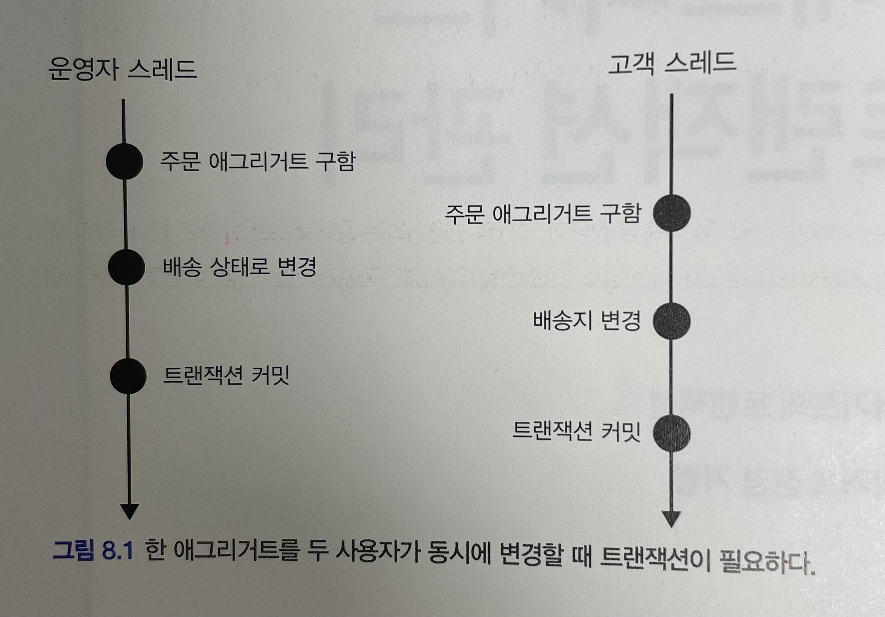
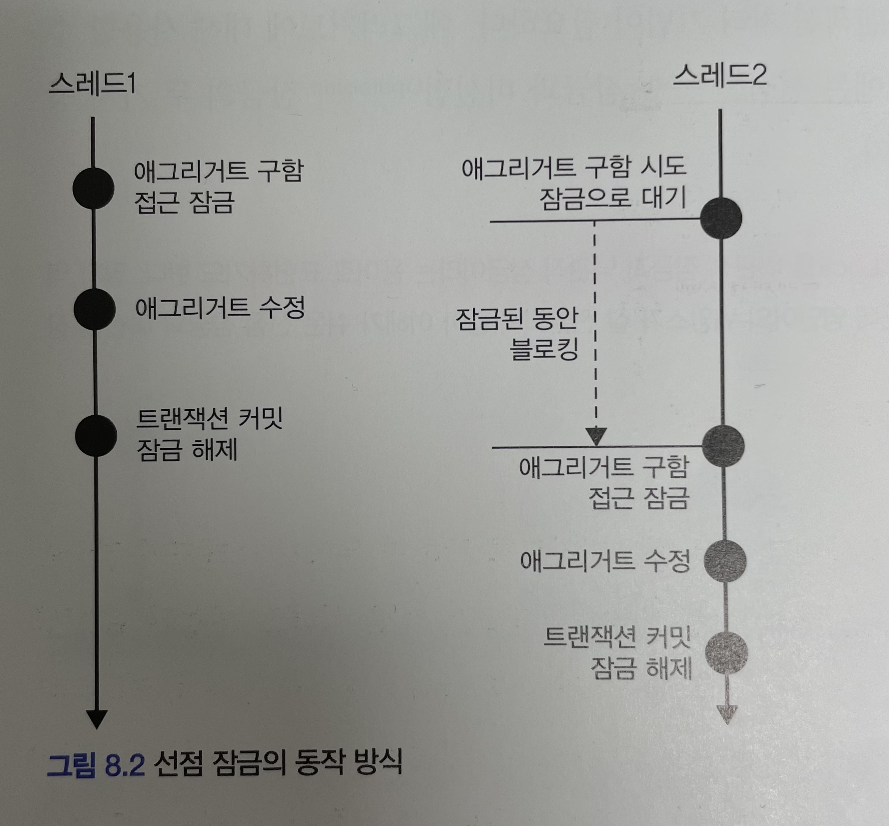
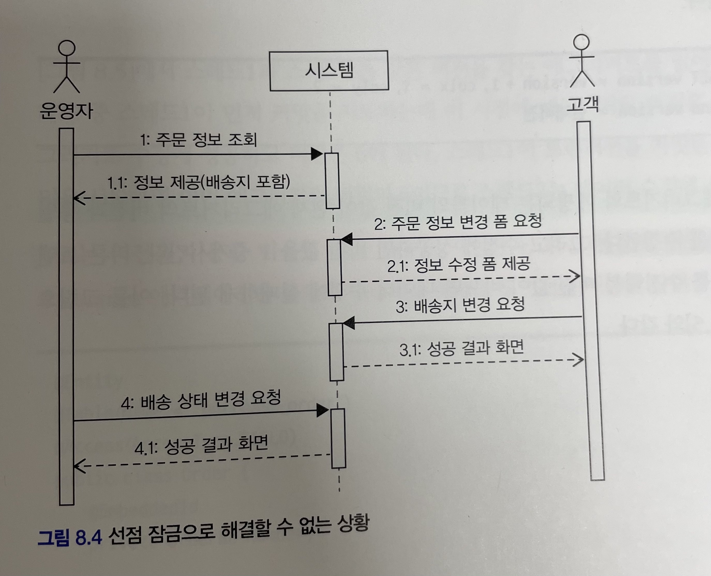
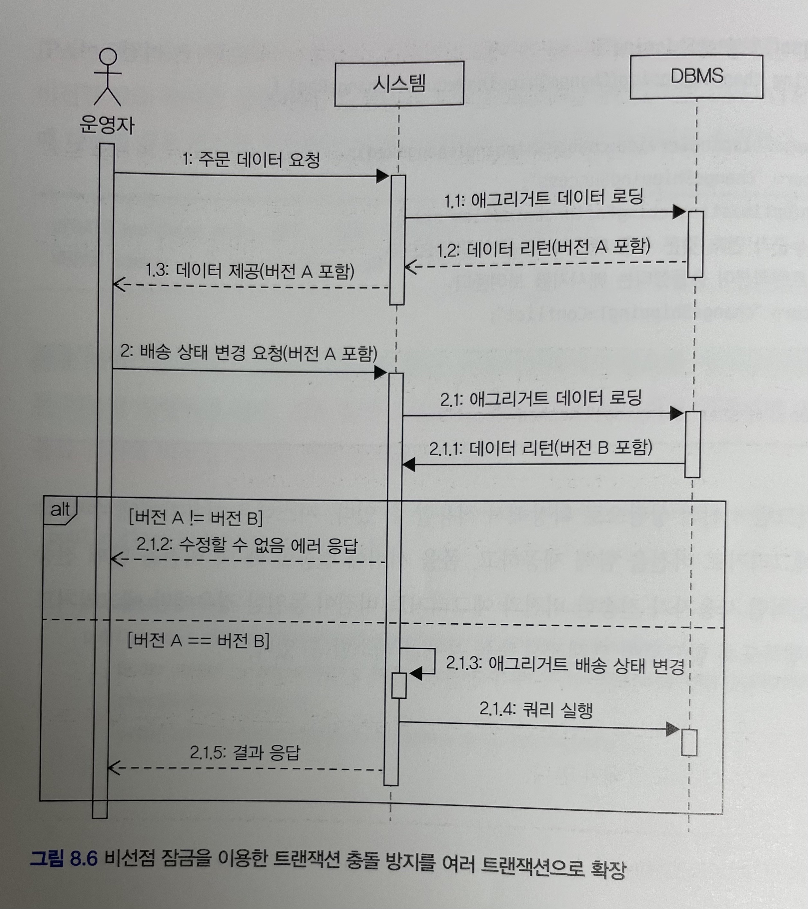

# 도메인 주도 개발 시작하기 : DDD 핵심 개념 정리부터 구현까지

- 정리 범위
  - Chapter 8 애그리거트 트랜잭션 관리 : 8.1 ~ 8.3

## 8. 애그리거트 트랜잭션 관리

### 8.1 애그리거트와 트랜잭션

한 주문 애그리거트에 대해 운영자는 배송 상태로 변경할 때 사용자는 배송지 주소를 변경하면 어떻게 될까?



- 한 애그리거트를 두 사용자가 동시에 변경할 때 트랜잭션이 필요하다.
- 운영자 스레드와 고객 스레드는 개념적으로 동일한 애그리거트, 그러나 물리적으로 서로 다른 애그리거트 객체를 사용
- 운영자 스레드가 주문 애그리거트 객체를 배송 상태로 변경하더라도 고객 스레드가 사용하는 주문 애그리거트는 객체에는 영향을 주지 않음
- 고객 스레드 입장에서 주문 애그리거트 객체는 아직 배송 상태 전이므로 배송지 정보 변경 가능

이 순서의 문제점은 운영자는 기존 배송지 정보를 이용해서 배송 상태로 변경하였는데, 그 사이 고객은 배송지 정보를 변경했다는 것

`즉, 애그리거트의 일관성이 깨지는 것이다.`

일관성이 깨지는 문제를 해결할 수 있는 두 가지 방안

- 운영자가 배송지 정보를 조회하고 상태를 변경하는 동안 고객이 애그리거트를 수정하지 못하게 막는다.
- 운영자가 배송지 정보를 조회한 이후에 고객이 정보를 변경하면 운영자가 애그리거트를 다시 조회한 뒤 수정하도록 한다.

위 문제는 트랜잭션과 관련이 있고 DBMS가 지원하는 트랜잭션과 함께 애그리거트를 위한 추가적인 트랜잭션 처리 기법이 필요하다. 대표적인 트랜잭션 처리 방법은 다음과 같다.

- 선점 잠금(Optimistic Lock, 낙관적 잠금)
- 비선점 잠금(Pessimistic Lock, 낙관적 잠금)
  
### 8.2 선점 잠금

`선점 잠금` 은 먼저 애그리거트를 구한 스레드가 애그리거트 사용이 끝날 때까지 다른 스레드가 해당 애그리거트를 수정하지 못하게 막는 방식



- 스레드1이 선점 잠금 방식으로 애그리거트를 구한 후 스레드2가 같은 애그리거트를 구하고 있다.
- 스레드2는 스레드1이 애그리거트에 대한 잠금을 해제할 때까지 블로킹 된다.
- 스레드1이 애그리거트를 수정하고 트랜잭션을 커밋하면 잠금을 해제한다.
- 이 순간 대기하고 있던 스레드2가 애그리거트에 접근하게 된다.
- 스레드1이 트랜잭션을 커밋한 뒤에 스레드2가 애그리거트를 구하게 되므로 스레드2는 스레드1이 수정한 애그리거트의 내용을 보게 된다.

한 스레드가 애그리거트를 구하고 수정하는 동안 다른 스레드가 수정할 수 없으므로 동시에 애그리거트를 수정할 때 발생하는 데이터 충돌 문제를 해소할 수 있다.

선점 잠금은 보통 DBMS가 제공하는 행단위 잠금을 사용해서 구현한다. 오라클을 비롯한 다수의 DBMS가 for update와 같은 쿼리를 사용해서 특정 레코드에 한 커넥션만 접근할 수 있는 잠금장치를 제공한다.

JPA EntityManager는 LockModType을 인자로 받는 find() 메서드를 제공한다. LockModType.PESSIMISTIC_WRITE를 값으로 전달하면 해당 엔티티와 매핑된 테이블을 이용해서 선점 잠금 방식을 적용할 수 있다.

하이버네이트의 경우 PESSIMISTIC_WRITE를 잠금 모드로 사용하면 for update 쿼리를 이용해서 선점 잠금 방식을 구현한다.

```java
Order order = entityManager.find(
    Order.class, orderNo, LockModeType.PESSIMISTIC_WRITE);
```

스프링 데이터 JPA는 @Lock 애너테이션을 사용해서 잠금 모드를 지정한다.

```java
public interface MemberRepository extends Repository<Member, MemberId> {

    @Lock(LockModeType.PESSIMISTIC_WRITE)
    @Query("select m from Member m where m.id = :id")
    Optional<Member> findByIdForUpdate(@Param("id") MemberId memberId);
}
```

#### 8.2.1 선점 잠금과 교착 상태

선점 잠금 기능을 사용할 때는 잠금 순서에 따른 교착 상태가 발생하지 않도록 주의해야 한다.

- `교착 상태` 란? 두 스레드가 먼저 선점한 잠금을 구할 수 없어 더 이상 다음 단계를 진행하지 못하게 되는 상황

선점 잠금에 따른 교착 상태는 상대적으로 사용자 수가 많을 때 발생할 가능성이 높고, 사용자수가 많아지면 교착 상태에 빠지는 스레드는 더 빠르게 증가한다. 더 많은 스레드가 교착 상태에 빠질수록 시스템은 아무것도 할 수 없는 상태가 된다.

이런 문제가 발생하지 않도록 하려면 잠금을 구할 때 최대 대기 시간을 지정해야 한다.

```java
Map<String, Object> hints = new Hashmap<>();
hints.put("javax.persistence.lock.timeout", 2000);
Order order = entityManager.find(
    Order.class, orderNo, LockModeType.PESSIMISTIC_WRITE, hints);
```

- `javax.persistence.lock.timeout` 힌트는 잠금을 구하는 대기 시간을 밀리초 단위로 지정
- 지정한 시간 이내에 잠금을 구하지 못하면 익셉션을 발생
- 이 힌트를 사용할 때 주의할 점은 DBMS에 따라 힌트가 적용되지 않을 수도 있다는 것

스프링 데이터 JPA는 @QueryHints 애너테이션을 사용해서 쿼리 힌트를 지정

```java
public interface MemberRepository extends Repository<Member, MemberId> {

    @Lock(LockModeType.PESSIMISTIC_WRITE)
    @QueryHints({
        @QueryHint(name = "javax.persistence.lock.timeout")
    })
    @Query("select m from Member m where m.id = :id")
    Optional<Member> findByIdForUpdate(@Param("id") MemberId memberId);
```

#### 예방할 수 있는 방법

- 상호배제

- 점유와 대기

- 비선점

- 원형 대기

#### DBMS에 따른 힌트

- 조사 필요

#### 선점 잠금의 종류

- OPTIMISTIC
  - 트랜잭션 시작 시 버전 점검이 수행되고, 트랜잭션 종료 시에도 버전 점검이 수행된다.
  - 버전이 다르면 트랜젹이 롤백된다.
- OPTIMISTIC_FORCE_INCREMENT
  - 낙관적 락을 사용하면서 추가로 버전을 강제로 증가시킨다.
  - 관계를 가진 다른 엔티티가 수정되면 버전이 변경된다.
- READ
  - `OPTIMISTIC1` 과 동일
- WTITE
  - `OPTIMISTIC_FORCE_INCREMENT` 와 동일
- NONE
  - 엔티티에 @Version이 적용된 필드가 있으면 낙관적 락을 적용

#### Lock Scope 설정 가능

### 8.3 비선점 잠금

선점 잠금이 강력해 보이긴 하지만 선점 잠금으로 모든 트랜잭션 충돌 문제가 해결되는 것은 아니다.



- 운영자는 배송을 위해 주문 정보를 조회한다. 시스템은 정보를 제공한다.
- 고객이 배송지 변경을 위해 변경 폼을 요청한다. 시스템은 변경 폼을 제공한다.
- 고객이 새로운 배송지를 입력하고 폼을 전송하여 배송지를 변경한다.
- 운영자가 1번에서 조회한 주문 정보를 기준으로 배송지를 정하고 배송 상태 변경을 요청한다.

여기에서 문제는 운영자가 배송지 정보를 조회하고 배송 상태로 변경하는 사이에 고객이 배송지를 변경하는 것
즉, 배송 상태 변경 전에 배송지를 한 번 더 확인하지 않으면 운영자는 다른 배송지로 물건을 발송하게 되고, 고객은 배송지를 변경했음에도 불구하고 엉뚱한 곳으로 주문한 물건을 받는 상황이 발생한다.

이러한 문제는 선점 방식으로 해결할 수 없다. 이때 필요한 것이 비선점 잠금이다.
비선점 잠금은 동시에 접근하는 것을 막는 대신 변경한 데이터를 실제 DBMS에 반영하는 시점에 변경 가능 여부를 확인하는 방식이다.

비선점 잠금을 구현하려면 애그리거트에 버전으로 사용할 숫자 타입 프로퍼티를 추가해야 한다. 애그리거트를 수정할 때마다 버전으로 사용할 프로퍼티 값이 1씩 증가하는데 이때 다음과 같이 쿼리를 사용한다.

```sql
UPDATE aggtable SET version = version + 1, colx = ?, coly = ?
WHERE aggid = ? and version = 현재버전
```

- 이 쿼리를 수정할 애그리거트와 매핑되는 테이블의 버전 값이 현재 애그리거트의 버전과 동일한 경우에만 데이터를 수정한다.

(그림4)

- 스레드1과 스레드2는 같은 버전을 갖는 애그리거트를 읽어와 수정
- 두 스레드 중 스레드1이 먼저 커밋을 시도하는데 이 시점에 애그리거트 버전은 여전히 5이므로 애그리거트 수정에 성공하고 버전은 6
- 스레드1이 트랜잭션을 커밋한 후에 스레드2가 커밋을 시도하면 이미 애그리거트 버전이 6이므로 스레드2는 데이터 수정에 실패

JPA는 버전을 이용한 비선점 잠금 기능을 지원한다. 다음과 같이 버전으로 사용할 필드에 @Version 애너테이션을 붙이고 매핑되는 테이블에 버전을 저장할 컬럼을 추가

```java
@Entity
@Table(name = "purchase_order")
@Access(AccessType.FIELD)
public class Order {
    @EmbeddeId
    private OrderNo number;

    @Version
    private long version;

    ...
}
```

- JPA는 엔티티가 변경되어 UPDATE 쿼리를 실행할 때 @Version에 명시한 필드를 이용해서 비선점 잠금을 쿼리를 실행한다.
- 즉 애그리거트 객체의 버전이 10이면 UPDATE 쿼리를 실행할 때 다음과 같은 쿼리를 사용해서 버전이 일치하는 경우에만 데이터를 수정한다.

```sql
UPDATE purchase_order SET ...생략, version = version + 1
WHERE number = ? and version = 10
```

응용 서비스는 버전에 대해 알 필요가 없다. 리포지터리에서 필요한 애그리거트를 구하고 알맞은 기능만 실행하면 된다. 기능 실행 과정에서 애그리거트 데이터가 변경되면 JPA는 트랜잭션 종료 시점에 비선점 잠금을 위한 쿼리를 실행한다.

```java
public class ChangeShippingService {
    @Transactional
    public void changeShipping(ChangeShippingRequest chageReq) {
        Order order = orderRepository.findById(new OrderNo(changeReq.getNumber()));
        checkNoOrder(order);
        order.changeShippingInfo(changeReq.getShippingInfo());
    }
}
```

비선점 잠금을 위한 쿼리를 실행할 때 쿼리 실행 결과로 수정된 행의 개수가 0이면 이미 누군가 앞서 데이터를 수정한 것이다.

- 이는 트랜잭션이 충돌한 것이므로 트랜잭션 종료 시점에 익셉션이 발생한다.

스프링의 @Transactional을 이용해서 트랜잭션 범위를 정했으므로 changeShipping() 메서드가 리턴될 때 트랜잭션이 종료되고, 이 시점에 트랜잭션 충돌이 발생하면 OptimisticLockingFailureException이 발생한다.

표현 영역 코드는 이 익셉션이 발생했는지에 따라 트랜잭션 충돌이 일어났는지 확인 가능

```java
@Controller
public class OrderController {
    private ChangeShippingService changeShippingService;

    @PostMapping("/changeShipping")
    public String changeShipping(ChangeShippingRequest chagneReq) {
        try {
            changeShippingService.changeShipping(changeReq);
            return "changeShippingSuccess";
        } catch (OptimisticLockingFailureException ex) {
            // 누군가 먼저 같은 주문 애그리거트를 수정했으므로 트랜잭션이 충돌했다는 메시지를 보여준다.
            return "changeShippingTxConflict";
        }
    }
}
```

비선점 잠금을 확장해서 적용한다면, 사용자에게 수정 폼을 제공할 때 애그리거트 버전을 함께 제공하고, 폼을 서버에 전송할 때 이 버전을 함께 전송하는 것이다.

- 사용자가 전송한 버전과 애그리거트 버전이 동일한 경우에만 애그리거트 수정 기능을 수행하도록 함으로써 트랜잭션 충돌을 해소할 수 있다.



- 만약 과정 1에서 받은 버전 A와 과정 2.1을 통해 읽은 애그리거트의 버전 B가 다르면 과정 1과 과정 2 사이에 다른 사용자가 해당 애그리거트를 수정한 것이다.
- 만약 버전 A와 버전 B가 같다면 과정 1과 과정 2 사이에 애그리거트를 수정하지 않은 것이다.
- 만약 과정 2.1.1과 과정 2.1.4 사이에 누군가 애그리거트를 수정해서 커밋했다면 버전 값이 증가한 상태가 되므로 트랜잭션 커밋에 실패하고 결과로 에러를 응답한다.

비선점 잠금 방식을 여러 트랜잭션으로 확장하려면 애그리거트 정보를 뷰로 보여줄 때 버전 정보도 함께 사용자 화면에 전달해야 한다.

- HTML 폼에서 hidden 타입 `<input>` 태그를 생성해서 폼 전 송 시 버전 값이 서버에 함께 전달되도록 한다.
- 응용 서비스에 전달할 요청 데이터를 사용자가 전송한 버전 값을 포함한다.
- 응용 서비스는 전달받은 버전 값을 이용해서 애그리거트 버전과 일치하는지 확인하고, 일치하는 경우에만 기능을 수행한다.

```java
public class StartShippingService {

    @PreAuthorize("hasRole("ADMIN")")
    @Transactional
    public void startShipping(StartShippingRequest req) {
        Order order = orderRepository.findById(new OrderNo(req.getOrderNumber()));
        checkOrder(order);
        if (!order.matchVersion(req.getVersion())) {
            throw new VersionConflictException();
        }
        order.startShipping();
    }
}
```

- matchVersion()의 결과가 true가 아니면 버전이 일치하지 않는 것이므로 사용자가 이전 버전의 애그리거트 정보를 바탕으로 상태 변경을 요청한 것
- 응용 서비스는 버전이 충돌했다는 익셉션을 발생시켜 표현 계층에 이를 알려야 한다.

표현 계층은 버전 충돌 익셉션이 발생하면 버전 충돌을 사용자에게 알려 사용자가 알맞은 후속 처리를 할 수 있도록 한다.

```java
@Controller
public class OrderAdminController {
    private StartShippingService startShippingService;

    @PostMapping("/startShipping")
    public String startShipping(StartShippingRequest startReq) {
        try {
            startShippingService.startShipping(startReq);
            return "shippingStarted";
        } catch(OptimisticLockingFailureException | VersionConflictException ex) {
            // 트랜잭션 충돌
            return "startShippingTxConflict";
        }
    }
}
```

- `OptimisticLockingFailureException` 은 스프링 프레임워크가 발생시키며, 누군가가 거의 동시에 애그리거트를 수정했다는 것을 의미
- `VersionConflictException` 은 응용 서비스 코드에서 발생시키며, 이미 누군가가 애그리거트를 수정했다는 것을 의미

버전 충돌 상황에 대한 구분이 명시적으로 필요 없다면 응용 서비스에서 프레임워크용 익셉션을 발생시키는 것도 고려할 수 있다.

```java
public void startShipping(StartShippingRequest req) {
    Order order = orderRepository.findById(new OrderNo(req.getOrderNumber()));
    checkOrder(order);
    if (!order.matchVersion(req.getVersion())) {
        // 프레임워크가 제공하는 비선점 트랜잭션 충돌 관련 익셉션 사용
        throw new OpimisticLockingFailureException("version conflict");
    }
    order.startShipping();
}
```

#### 8.3.1 강제 버전 증가

애그리거트에 애그리거트 루트 외에 다른 엔티티가 존재하는데 기능 실행 도중 루트가 아닌 다른 엔티티의 값만 변경되었다면?

- JPA는 루트 엔티티의 버전 값을 증가시키지 않는다. 

비록 루트 엔티티의 값이 바뀌지 않았더라도 애그리거트의 구성요소 중 일부 값이 바뀌면 논리적으로 그 애그리거트는 바뀐 것이다.
따라서 애그리거트 내에 어떤 구성요소의 상태가 바뀌면 루트 애그리거트의 버전 값이 증가해야 비선점 잠금이 올바르게 동작한다.

JPA는 이런 문제를 처리할 수 있도록 EntityManger#find() 메서드로 엔티티를 구할 때 강제로 버전 값을 증가시키는 잠금 모드를 지원한다.

```java
@Repository
public class JpaOrderRepository implements OrderRepository {
    @PersistenceContext
    private EntityManager entityManager;

    @Override
    public Order findByIdOptmisticLockMode(OrderNo id) {
        return entityManager.find(Order.class, id, LockModeType.OPTIMISTIC_FORCE_INCREMENT);
    }
}
```

- `LockModeType.OPTIMISTIC_FORCE_INCREMENT` 를 사용하면 해당 엔티티의 상태가 변경되었는지에 상관없이 트랜잭션 종료 시점에 버전 값 증가 처리를 한다.
- 이 잠금 모드를 사용하면 애그리거트 루트 엔티티가 아닌 다른 엔티티나 밸류가 변경되더라도 버전 값을 증가시킬 수 있으므로 비선점 잠금 기능을 안전하게 적용할 수 있다.
- 스프링 데이터 JPA를 사용하면 앞서 살펴본 @Lock 애너테이션을 이용해서 지정하면 된다.

#### 비선점 잠금의 종류

- PESSIMISTIC_READ
  - 해당 리소스에 공유락 설정
  - 타 트랜잭션에서 읽기는 가능하지만 쓰기를 불가능
- PESSIMISTIC_WRITE
  - 해당 리소스에 베타락 설정
  - 타 트랜잭션에서 읽기과 쓰기 모두 불가능
  - 단, DBMS 종류의 따라 상황아 달라짐
- PESSIMISTIC_FORCE_INCREMENT
  - 해당 리소스에 베타락 설정
  - 타 트랜잭션에서는 읽기와 쓰기 모두 불가능
  - 추가적으로 선점 잠금 버저닝 가능하여 버전 컬럼 필요

#### @Lock 설정 예제

Repository에서 선점 방식은 다음과 같이 `@Lock` 어노테이션을 선언하면 사용 가능하다.

```java
public interface UserRepository extends JpaRepository<User, Long> {

  @Lock(LockModeType.PESSIMISTIC_FORCE_INCREMENT)
  Optional<User> findWithOptimisticLockById(Long id);
}
```

기본적으로 Lock은 `@Transactional` 로 트랜잭션을 잡아주어야 정상적으로 작동 가능하다.

```java
@Transactional
public void findUser() {
    User user = userRepository.findWithOptimisticLockById(1L)
            .orElseThrow(() -> new RuntimeException("존재하지 않음"));
    user.updateStatus(true);
}
```
