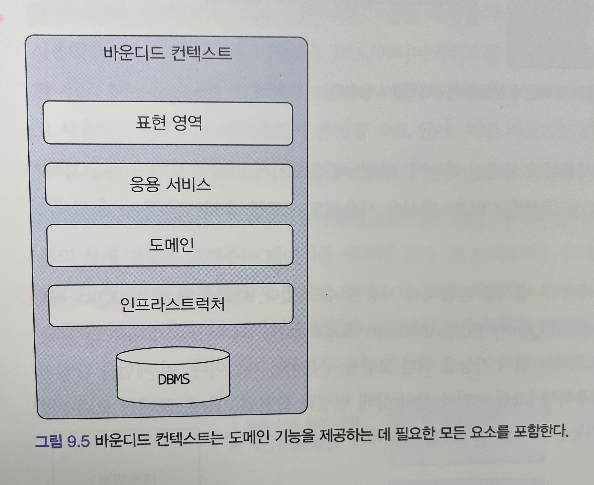
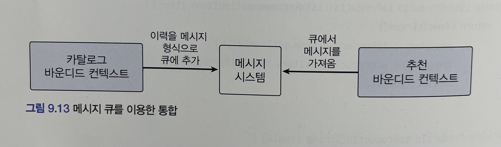

# 도메인 주도 개발 시작하기 : DDD 핵심 개념 정리부터 구현까지

- 정리 범위
  - Chapter 8 애그리거트 트랜잭션 관리 : 9.1 ~ 9.4

## 9. 도메인 모델과 바운디드 컨텍스트

### 9.1 도메인 모델과 경계

한 도메인은 다시 여러 하위 도메인으로 구분되기 때문에 한 개의 모델로 여러 하위 도메인을 모두 표현하려고 시도하면 오히려 모든 하위 도메인에 맞지 않는 모델을 만들게 된다.

- 예를 들어, 상품이라는 모델을 생각해 보면, 카탈로그에서 상품, 재고 관리에서 상품, 주문에서 상품, 배송에서 상품은 이름만 같지 실제로 의미하는 것이 다르다.
- 카탈로그에서 상품은 상품 이미지, 상품명, 상품 가격, 옵션 목록, 상세 설명과 같은 상품 정보가 위주
- 재고 관리에서는 실존하는 개별 객체를 추적하기 위한 목적으로 상품을 사용
- 즉 카탈로그에서는 물리적으로 한 개인 상품이 재고 관리에서는 여러 개 존재 가능

논리적으로 같은 존재처럼 보이지만 하위 도메인에 따라 다른 용어를 사용하는 경우도 있다.

- 카탈로그 도메인에서의 상품이 검색 도메인에서는 문서로 불리기도 한다.
- 비슷하게 시스템을 사용하는 사람을 회원 도메인에서는 회원이라고 부르지만, 주문 도메인에서는 주문자라고 부르고, 배송 도메인에서는 보내는 사람이라고 부르기도 한다.

한 개의 모델로 모든 하위 도메인을 표현하려는 시도는 올바른 방법이 아니며 표현할 수도 없다.

- 하위 도메인마다 사용하는 용어가 다르기 때문에 올바른 도메인 모델을 개발하려면 하위 도메인마다 모델을 만들어야 한다.
- 각 모델은 명시적으로 구분되는 경계를 가져서 섞이지 않도록 해야 한다.

모델은 특정한 컨텍스트(문맥) 하에서 완전한 의미를 갖는다. 같은 제품이라도 카탈로그 컨텍스트와 재고 컨텍스트에서 의미가 서로 다르다. 이렇게 구분되는 경계를 갖는 컨텍스트를 DDD에서는 바운디드 컨텍스트라고 부른다.

### 9.2 바운디드 컨텍스트

바운디드 컨텍스트는 모델의 경계를 결정하며 한 개의 바운디드 컨텍스트는 논리적으로 한 개의 모델을 갖는다.

바운디드 컨텍스트는 용어를 기준으로 구분한다.

- 카탈로그 컨텍스트와 재고 컨텍스트는 서로 다른 용어를 사용
- 이 용어를 기준으로 컨텍스트는 분리 가능

바운디드 컨텍스트는 실제로 사용자에게 기능을 제공하는 물리적 시스템으로 도메인 모델은 이 바운디드 컨텍스트 안에서 도메인을 구현한다.

이상적으로 하위 도메인과 바운디드 컨텍스트가 일대일 관계를 가지면 좋겠지만 현실은 그렇지 않을 때가 많다. 

- 바운디드 컨텍스트는 기업의 팀 조직 구조에 따라 결정되기도 한다.
- 예를 들어, 주문 하위 도메인이라도 주문을 처리하는 팀과 복잡한 결제 금액 계산 로직을 구현하는 팀이 따로 있다고 해보자.
- 이 경우 주문 하위 도메인에 주문 바운디드 컨텍스트와 결제 금액 계산 바운디드 컨텍스트가 존재하게 된다.

용어를 명확하게 구분하지 못해 두 하위 도메인을 하나의 바운디드 컨텍스트에서 구현하기도 한다.

- 예를 들어, 카탈로그와 재고 관리가 아직 명확하게 구분되지 않은 경우 두 하위 도메인을 하나의 바운디드 컨텍스트에서 구현하기도 한다.

규모가 작은 기업은 전체 시스템을 한 개 팀에서 구현할 때도 있다.

- 예를 들어, 소규모 쇼핑몰은 한 개의 웹 어플리케이션으로 온라인 쇼핑몰 서비스하며 하나의 시스템에서 회원, 카탈로그, 재고, 구매, 결제와 관련된 모든 기능을 제공
- 즉, 여러 하위 도메인을 한 개의 바운디드 컨텍스트에서 구현한다.

한 개의 바운디드 컨텍스트가 여러 하위 도메인을 포함하더라도 하위 도메인마다 구분되는 패키지를 갖도록 구현해야 하며, 이렇게 함으로써 하위 도메인을 위한 모델이 서로 뒤섞이지 않고 하위 도메인마다 바운디드 컨텍스트를 갖는 효과를 낼 수 있다.

바운디드 컨텍스트는 도메인 모델을 구분하는 경계가 되기 때문에 바운디드 컨텍스트는 구현하는 하위 도메인에 알맞은 모델을 포함한다.

### 9.3 바운디드 컨텍스트 구현

바운디드 컨텍스트 도메인 기능을 사용자에게 제공하는 데 필요한 표현 영역, 응용 서비스, 인프라스트럭처 영역을 모두 포함한다.

모든 바운디드 컨텍스트를 반드시 도메인 주고로 개발할 필요는 없다.

- 복잡한 도메인 로직을 갖지 않는다면 CRUD 방식으로 구현해도 된다.
- DAO와 데이터 중심의 밸류 객체를 이용해서 구현해도 기능을 유지 보수하는데 큰 문제가 없다.

서비스-DAO 구조를 사용하면 도메인 기능이 서비스에 흩어지게 되지만 도메인 기능 자체가 단순하면 서비스-DAO로 구성된 CRUD 방식을 사용해도 코드를 유지 보수하는 데 문제 되지 않는다고 생각한다.

한 바운디드 컨텍스트에서 두 방식을 혼합해서 사용할 수도 있다.

- 대표적인 예가 CQRS 패턴이다.
- CQRS는 Command Query Responsibility Segregation의 약자로 상태를 변경하는 명령 기능과 내용을 조회하는 쿼리 기능을 위한 모델을 구분하는 패턴

각 바운디드 컨텍스트는 서로 다른 구현 기술을 사용할 수도 있다.

- 스프링 MVC, JPA/하이버네이트
- Netty, 마이바티스

바운디드 컨텍스트가 반드시 사용자에게 보여지는 UI를 가지고 있어야 하는 것은 아니다.

- UI를 갖지 않고 Rest API 통신

- UI 서버를 통해 간접적으로 브라우저와 통신

### 9.4 바운디드 컨텍스트 간 통합

요구사항

- 온라인 쇼핑몰 사이트에 매출 증대를 위한 카탈로그 하위 도메인에 개인화 추천 기능 도입

기존 카탈로그 시스템을 개발하던 팀과 별도로 추천 시스템을 담당하는 팀이 새로 생겨서 이 팀에서 주도적으로 추천 시스템을 만들기도 했다.

- 카탈로그 하위 도메인에는 기존 카탈로그를 위한 바운디드 컨텍스트와 추천 기능을 위한 바운디드 컨텍스트 존재

두 팀이 관련된 바운디드 컨텍스트를 개발하면 자연스럽게 두 바운디드 컨텍스트 간 통합이 발생하며, 통합의 필요한 기능은 다음과 같다.

- 사용자가 제품 상세 페이지를 볼 때, 보고 있는 상품과 유사한 상품 목록을 하단에 보여준다.

사용자가 카탈로그 바운디드 컨텍스트에 추천 제품 목록 요청

- 카탈로그 바운디드 컨텍스트는 추천 바운디드 컨텍스트로부터 추천 정보를 읽는다.
- 읽은 추천 제품 목록을 제공한다.

카탈로그 컨텍스트와 추천 컨텍스트의 도메인 모델은 서로 다르다.

- 카탈로그는 제품을 중심으로 도메인 모델을 구현
  - 카탈로그 시스템은 추천 시스템으로부터 추천 데이터를 응답
  - 카탈로그 시스템에서는 추천의 도메인 모델을 사용하기보다는 카탈로그 도메인 모델을 사용해서 추천 상품을 표현
- 추천은 추천 연산을 위한 모델을 구현
  - 추천 시스템은 상품의 상세 정보를 포함하지 않으며 상품 번호 대신 아이템 ID라는 용어를 사용해서 식별자를 표현하고 추천 순위와 같은 데이터를 표현

도메인 서비스를 구현한 클래스는 인프라스트럭처 영역에 위치한다.

- RecSystemClient는 외부 추천 시스템이 제공하는 REST API를 이용해서 특정 상품을 위한 추천 상품 목록을 로딩
  - 추천 시스템의 모델을 기반으로 하고 있기 때문에 API 응답은 카탈로그 도메인 모델과 일치하지 않는 데이터를 제공
  - 즉, 변환이 필요하다.

- 두 모델 간의 변환 과정이 복잡하면 변환 처리를 위한 별도 클래스를 생성

두 바운디드 컨텍스트를 통합하는 방법

- 직접적 통합하는 방법
  - REST API
- 간접적 통합하는 방법
  - 메시지 큐

간접적 통합 방법인 메시지 큐 사용 시 관리하는 주체의 따라,

- 카탈로그 바운디드 컨텍스트를 따르는 데이터
- 추천 바운디드 컨텍스트를 따르는 데이터

두 바운디드 컨텍스트를 개발하는 팀은 메시징 큐에 담을 데이터의 구조를 협의하게 되는데 그 큐를 누가 제공하느냐에 따라 데이터 구조가 결정된다

- 예를 들어, 카탈로그 시스템에서 큐를 제공한다면 큐에 담기는 내용은 카탈로그 도메인을 따른다.
- 카탈로그 도메인은 메시징 큐에 카탈로그와 관련된 메시지를 저장하게 되고 다른 바운디드 컨텍스트는 이 큐로부터 필요한 메시지를 수신하는 방식을 사용한다.
- 즉, 이 방식은 한쪽에서 메시지를 출판하고 다른 쪽에서 메시지를 구독하는 출판/구독 모델을 따른다.

#### 마이크로 서비스와 바운디드 컨텍스트

마이크로서비스? 

- 애플리케이션을 작은 서비스로 나누어 개발하는 아키텍처 스타일
- 개별 서비스를 독립된 프로세스로 실행하고 각 서비스가 REST API나 메시징을 이용해서 통신하는 구조

마이크로 서비스의 특징은 바운디드 컨텍스트와 잘 어울린다.

- 바운디드 컨텍스트는 모델의 경계를 형성
- 바운디드 컨텍스트르 마이크로서비스로 구현하면 컨텍스르별로 모델이 분리
- 코드 수준에서 마이크로서비스마다 프로젝트 생성하므로 바운디드 컨텍스트마다 프로젝트를 생성
  - 모델을 분리하여 두 바운디드 컨텍스트의 모델이 섞이지 않도록 해결

## 참고

### BOUNDED CONTEXT

- 하위 도메인마다 같은 용어라도 의미가 다르고 같은 대상이라도 지칭하는 용어가 다를 수 있기 때문에 한 개의 모델로 모든 하위 도메인을 표현하려는 시도는 올바른 방법이 아니며 표현할 수도 없다.
- 하위 도메인마다 사용하는 용어가 다르기 때문에 올바른 도메인 모델을 개발하려면 하위 도메인마다 모델을 만들어야 한다.
- 모델은 특정한 컨텍스트(문맥)하에서 완전한 의미를 갖는다.
- 이렇게 구분되는 경계를 갖는 컨텍스트를 DDD에서는 BOUNDED CONTEXT라고 부른다.

### 좋은 BOUNDED CONTEXT

- 하나의 BOUNDED CONTEXT는 하나의 팀에만 할당되어야 한다.
- 하나의 팀은 여러 개의 BOUNDED CONTEXT를 다룰 수 있다.
- 각각의 BOUNDED CONTEXT는 각각의 개발 환경을 가질 수 있다.

### CONTEXT MAP

- 컨텍스트 맵은 상호 교류하는 시스템의 목록을 제공하고, 팀 내 의사소통의 촉매 역할을 한다.

### 프로젝트와 조직 관계

- 파트너십(Partnership) : 두 CONTEXT가 하나의 트랜잭션으로 묶여 있다.
- 공유 커널(Shared kernel) : 상호 의존하는 공유 모델을 관리한다.
- 고객-공급자(Customer-Supplier Development) : 업스트림(서버:공급자), 다운스트림(클라이언트:고객)로 단방향으로 의존한다.
- 순응주의자(Conformist) : 업스트림(서버)이 모든 것을 제어한다.
- 오픈 호스트 서비스(Open Host Service) : REST/API, RPC, Socket
- 분리된 방법(Seprate Ways) : 의존 없음
- 큰 진흙공(Big ball of mud) : 안티 패턴