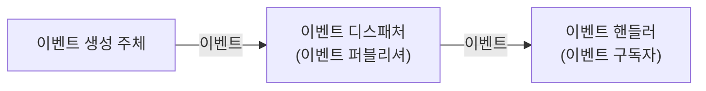
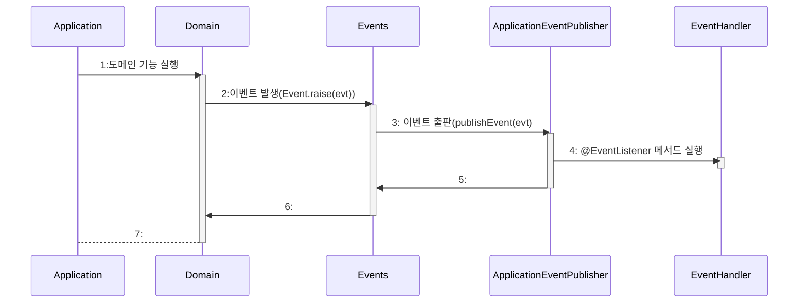
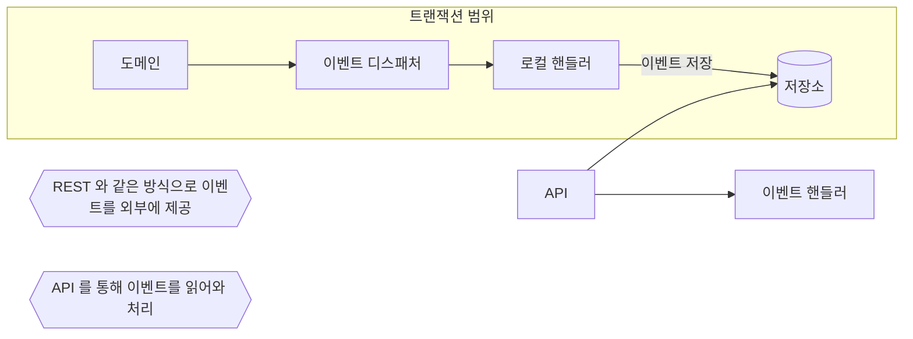
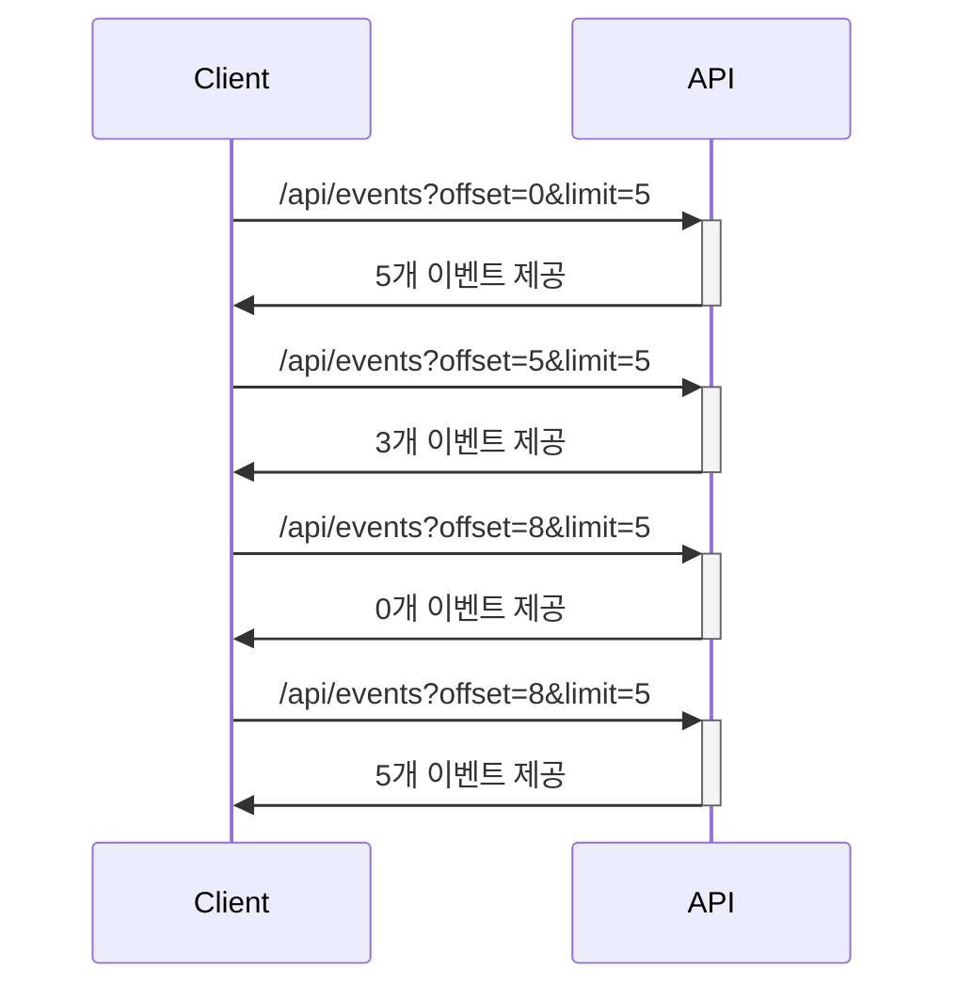
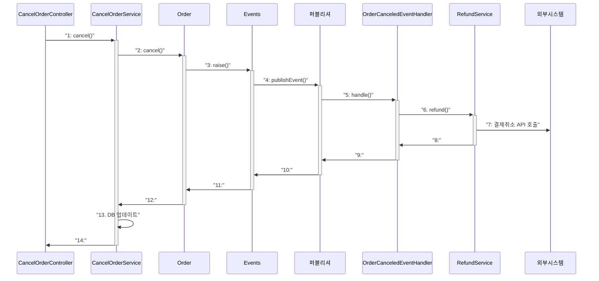
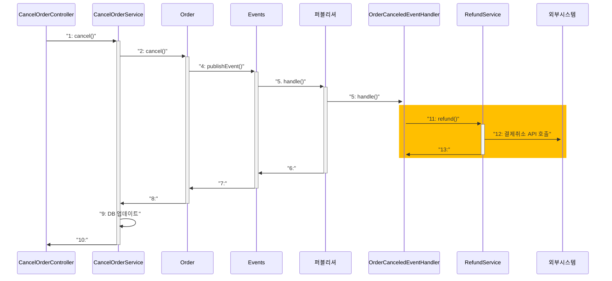

# Chapter 10 이벤트

# 10.1 시스템 간 강결합 문제

- **도메인 객체**에서 환불 기능을 실행하려면 환불 기능을 실행하는 **도메인 서비스**와 협력(의존성)해서 기능을 실행해야 한다.

  **Domain Layer 에서 처리**

    ```kotlin
    class Order {
    	// 외부 서비스를 실행하기 위해 도메인 서비스를 파라미터로 전달 받는다.
    	fun cancel(refundService: RefundService) {
    		verifyNotYetShipped()
    		this.state = OrderState.CANCELED
    		
    		this.refundState = State.REFUND_STARTED
    		try {
    			refundService.refund(getPaymentId())
    			this.refundStatus = State.REFUND_COMPLETED
    		} catch (ex: Exception) {
    			???
    		}
    	}
    }
    ```

  **Application Layer 에서 처리**

    ```kotlin
    class CancelOrderService(private val refundService: RefundService) {
    	@Transactional
    	fun cancel(orderNo: OrderNo) {
    		// 주문 로직
    		with(findOrder(orderNo)) {
    			this.cancel()
    		//
    
    		// 결제 로직
    			this.refundStarted()
    			try {
    				// 외부 서비스 성능에 직접 영향 받게 된다.
    				refundService.refund(this.getPaymentId())
    				this.refundCompleted()
    			} catch(ex: Exception) {
    				???
    			}
    	 // 
    		}		
    	}
    }
    ```

- **문제점**
- **외부 서비스에 의존하게 되면서 외부 서비스의 성능에 대해 직접적으로 영향을 받게 된다.**
    - 외부 서비스(환불처리 시스템, `RefundService`) 가 정상이 아닌 경우는 어떻게 해야 하는가?
        - 트랜잭션 롤백?
        - 일단 주문 취소처리 하고 추후 환불?
    - 외부 서비스(환불처리 시스템, `RefundService`) 의 성능이 떨어진다면?
        - 응답할 때까지 기다려야 하는가?
- **주문 도메인과 결제 도메인이 섞이게 된다.**
    - 환불 기능이 바뀌면 주문 도메인(Order)이 영향을 받는다.
    - 환불 기능이 추가될 때마다 주문 도메인(Order)이 영향을 받는다.
        - 트랜잭션 범위가 커지고 처리방법이 더 복잡해질 수 있다.

            ```kotlin
            class Order {
            	// 기능을 추가할 때마다 파라미터가 함께 추가되면
            	// 다른 로직이 더 많이 섞이고, 트랜잭션 처리가 더 복잡해진다.
            	fun cancel(refundService: RefundService, notiSvc: NotiService) {
            		verifyNotYetShipped()
            		this.state = OrderState.CANCELED
            
            		// 주문 + 결제 + 통지 로직이 섞임
            		// refundService 는 성공하고, notiSvc 는 실패하면?
            		// refundService 와 notiSvc 중 무엇을 먼저 처리하나?
            	}
            }
            ```

- **원인**
    - **주문 바운디드 컨텍스트**와 **결제 바운디드 컨텍스트** 간의 강결합(high coupling)

# 10.2 이벤트 개요

- **이벤트(Event)** 란, **과거에 벌어진 어떤 것**
- 도메인 모델 관점에서 이벤트는
    - ~ 할 때 /  ~가 발생하면 / 만약 ~하면 과 같은 요구사항이 나타난다. → 도메인 상태변경

## 10.2.1 이벤트 관련 구성요소

| 역할명 | 역할 | 대상 |
| --- | --- | --- |
| 이벤트 생성주체 | 이벤트를 발생시키는 주체 | ENTITY / VALUE / Domain Service |
| 이벤트 디스패처(퍼블리셔) | 발생한 이벤트를 처리할 수 있는 이벤트 핸들러에게 전달한다. |  |
| 이벤트 핸들러(구독자) | 이벤트에 반응하여 이벤트를 처리한다. |  |



## 10.2.2 이벤트의 구성

| 이벤트 종류 | 클래스 이름으로 이벤트 종류를 표현 |
| --- | --- |
|  | 클래스 이름은 과거시제를 사용한다. |
| 이벤트 발생시간 | 이벤트가 발생한 시간정보 |
| 추가 데이터 | 주문번호, 신규 배송지 정보 등 이벤트와 관련된 정보 |

**Event**

```kotlin
class ShippingChangedEvent(
	val orderNumber: String,
	val timestamp: Long,
	val newShipping: Shipping
)
```

**Event Producer**

```kotlin
class Order {
	fun changeShipping(newShipping: Shipping) {
		verifyNotYetShipped()
		setShipping(newShipping)
		// 이벤트 발생
		Events.raise(ShippingChangedEvent(number, newShipping))
	}
}
```

**Event Handler**

```kotlin
class ShippingChangedHandler(
	private val shippingSyncronizer: ShippingSyncronizer
) {
	@EventListener(ShippingChangedEvent::class.java)
	fun handle(evt: ShippingChangedEvent) {
		shippingSyncronizer.sync(evt.orderNumber, evt.newShipping)
	}
}
```

- 이벤트는 이벤트 핸들러가 이벤트를 처리하는데 필요한 데이터만 담아야 한다.
    - 데이터가 부족하면 이벤트 핸들러가 이벤트를 처리할 때마다 데이터를 조회해야 한다.

        ```kotlin
        class ShippingChangedHandler(
        	private val shippingSyncronizer: ShippingSyncronizer,
        	private val orderRepository: OrderRepository
        ) {
        	@EventListener(ShippingChangedEvent::class.java)
        	fun handle(evt: ShippingChangedEvent) {
        		// 이벤트가 필요한 데이터를 담고 있지 않으면,
        		// 이벤트 핸들러는 리포지터리 / 조회 API / DB 를 직접 접근 동의
        		// 방식을 통해 필요한 데이터를 조회해야 한다.
        		val order = orderRepository.findById(evt.orderNumber)
        		shippingSyncronizer.sync(evt.orderNumber, evt.newShipping)
        	}
        }
        ```


## 10.2.3 이벤트 용도

- **트리거**
    - 도메인 상태가 바뀔 때마다 반드시 후처리가 필요한 경우 사용할 수 있다.

    ```mermaid
    graph LR
      Order --OrderCanceledEvent--> EventDispatcher --OrderCanceledEvent--> OrderCanceledEventHandler --> RefundService
    ```

  그림 10.4 이벤트는 다른 기능을 실행하는 트리거가 된다. [출처: 도메인 주도개발 시작하기 / 최범균]


- **서로 다른 시스템 간의 데이터 동기화**
    - 배송지를 변경하면 → 외부 배송 서비스에 변경된 배송지 반영

## 10.2.4 이벤트 장점

- 서로 다른 도메인 로직이 섞이는 것을 방지할 수 있다.

  

  [출처: 도메인 주도개발 시작하기 / 최범균]

- **기능 확장이 용이하다.**
    - 만약, 구매취소하면 환불과 함께 이메일로 취소내용을 전송한다면?
        1. 이메일로 취소내용을 전송하는 이벤트 핸들러를 생성
        2. 구매취소 이벤트를 구독하여 처리한다.

        ```mermaid
        
        		flowchart LR
        		  Order---OCE1["OrderCanceledEvent"]-->ED["EventDispatcher"]---OCE2["OrderCanceledEvent"]-->OCEH1["OrderCanceledEventHandler"]-->Refund["환불\n처리"]
        			ED---OCE3["OrderCanceledEvent"]-->OCEH2["OrderCanceledEventHandler"]-->Email["이메일\n통지"]
        
        			style Order fill:#D2B4DE
        			style ED fill:#D2B4DE
        			style OCEH1 fill:#D2B4DE
        			style Refund fill:#D2B4DE
        			style OCEH2 fill:#D2B4DE
        			style Email fill:#D2B4DE
        	
        ```

      그림 10.6 이벤트 핸들러를 추가해서 도메인 로직에 영향 없이 기능 확장


# 10.3 이벤트, 핸들러, 디스패처 구현

| 이벤트 클래스 | 이벤트를 표현한다.(과거형) |
| --- | --- |
| 디스패처 | 스프링이 제공하는 ApplicationEventPublisher 를 이용한다. |
|  | 이벤트를 등록한다. |
| Events | 이벤트를 발행한다. |
|  | 스프링이 제공하는 ApplicationEventPublisher 를 이용한다. |
| 이벤트 핸들러 | 이벤트를 수신해서 처리한다. |
|  | 스프링이 제공하는 기능을 사용한다. |

## 10.3.1 이벤트 클래스

- 이벤트는 과거에 벌어진 상태 변화나 사건을 의미하므로 이벤트 클래스의 이름을 결정할 때에는 과거시제를 사용해야 한다.
- 이벤트를 처리하는데 필요한 최소한의 데이터를 포함해야 한다.

```kotlin
class OrderCanceledEvent(val orderNumber: String)
```

- 모든 이벤트가 공통으로 갖는 프로퍼티가 존재한다면 관련 상위 클래스를 만들 수도 있다.

```kotlin
abstract class Event(
	val timestamp: Long = System.currentTimeMillis()
)

class OrderCanceledEvent(val orderNumber: String) : Event()
```

## 10.3.2 Events 클래스와 ApplicationEventPublisher

- 이벤트 발생과 출판을 위해 스프링이 제공하는 `ApplicationEventPublisher` 를 사용한다.

**Events**

```kotlin
class Events {
    companion object {
        private var publisher: ApplicationEventPublisher? = null
        
				fun setPublisher(publisher: ApplicationEventPublisher) {
            Events.publisher = publisher
        }

        fun raise(event: Any) = publisher?.publishEvent(event)
    }
}
```

**EventsConfiguration**

```kotlin
@Configuration
open class EventsConfiguration {
    @Autowired
    private lateinit var applicationContext: ApplicationContext

    @Bean
    open fun eventsInitializer(): InitializingBean = InitializingBean {
            Events.setPublisher(applicationContext)
    }
}
```

## 10.3.3 이벤트 발생과 이벤트 핸들러

- 이벤트를 처리할 핸들러는 스프링이 제공하는 `@EventListener` 어노테이션을 사용해서 구현한다.

**Order (이벤트 발생)**

```kotlin
class Order {
	fun cancel() {
		verifyNotYetShipped()
		
		this.state = OrderState.CANCELED
		Events.raise(OrderCanceledEvent(orderNumber.number))
	}
}
```

**OrderCanceledEventHandler (이벤트 처리)**

```kotlin
@Service
class OrderCanceledEventHandler(private val refundService: RefundService) {
	
	@EventListener(OrderCanceledEvent::class.java)
	fun handle(event: OrderCanceledEvent) {
		refundService.refund(event.orderNumber)	
	}
}
```

## 10.3.4 흐름 정리

- 도메인 상태 변경과 이벤트 핸들러는 같은 트랜잭션 범위에서 실행된다.



# 10.4 동기 이벤트 처리 문제

- 외부 서비스로부터 영향을 받는다.
    - 외부 서비스가 느려지면 내부 서비스도 느려진다.
    - 외부 서비스에서 예외가 발생한다면 어떻게 해야 하는가?

```kotlin
// 1. 응용 서비스 코드
// 외부 연동 과정에서 익셉션이 발생하면 트랜잭션 처리는?
@Transactional 
fun cancel(orderNo: OrderNo) {
	val order = findOrder(orderNo)
	// order.cancel() 에서 OrderCanceledEvent 발생
	order.cancel() 
}

// 2. 이벤트를 처리하는 코드
@Service
class OrderCanceledEventHandler(private val refundService: RefundService) {
	@EventListener(OrderCanceledEvent::class.java)
	fun handle(event: OrderCanceledEvent) {
		// refundService.refund() 가 느려지거나 익셉션이 발생하면
		refundService.refund(event.orderNumber)
	}
}
```

# 10.5 비동기 이벤트 처리

- 주문을 취소하는 즉시 결제를 취소하지 않아도 된다.
- “A 하면, B 하라” → “A 하면, 언제까지 B 하라”


    | 이벤트(“A 하면”) | “주문취소 하면” |
    | --- | --- |
    |  | 주문 취소 이벤트(OrderCanceledEvent) |
    | 비동기 핸들러(“언제까지 B 하라”) | “결제를 취소하라” |
    |  | 주문 취소 비동기 처리(OrderCanceledEventHandler) |

## 10.5.1 로컬 핸들러 비동기 실행

- 이벤트 핸들러를 별도의 쓰레드로 실행
- `@EnableAsync`, `@Async`

    ```kotlin
    @SpringBootApplication
    @EnableAsync
    class ShopApplication {}
    
    fun main(args: Array<String>) {
    	runApplication<ShopApplication>(*args)
    }
    ```

    ```kotlin
    @Service
    class OrderCanceledEventHandler(private val refundService: RefundService) {
    	@Async
    	@EventListener(OrderCanceledEvent::class.java)
    	fun handle(event: OrderCanceledEvent) {
    		refunService.refund(event.orderNumber)
    	}
    }
    ```


## 10.5.2 메시징 시스템을 이용한 비동기 구현

- Kafka, RabbitMQ
- 이벤트를 메시지 큐에 저장하는 과정과 메시지 큐에서 이벤트를 읽어와 처리하는 과정은 별도의 쓰레드 또는 프로세스로 처리

    ```mermaid
    flowchart LR
    	subgraph S1["트랜잭션 범위"]
    		A["Order"]--"Events.raise()"-->B["Events"]
    	end
    	subgraph S2["트랜잭션 범위"]
    		B["Events"]--"메시징 전송"-->C["메시징 시스템"]
    		C--"onMessage()"-->D["MessageListener"]
    		D--"handle()"--> E["이벤트 핸들러"]
    	end
    ```

  [출처: 도메인 주도개발 시작하기 / 최범균]

- 단점
    - 이벤트를 발생시키는 도메인 기능과 메시지 큐에 이벤트를 저장하는 절차를 한 트랜잭션으로 묶어야 한다.
    - 글로벌 트랜잭션 지원이 안될 수 있고 성능이 상대적으로 떨어진다.

## 10.5.3 이벤트 저장소를 이용한 비동기 처리

### 포워더 방식

- 이벤트를 DB 에 저장한 후, 이벤트 핸들러에게 전달
    - 도메인의 상태와 이벤트 저장소는 동일한 DB 를 사용한다. → 상태변화와 이벤트 저장은 하나의 트랜잭션

    ```mermaid
    flowchart LR
    	subgraph T1["트랜잭션 범위"]
    		A["도메인"]-->B["이벤트 디스패처"]-->C["로컬 핸들러"]--"이벤트 저장"-->D[("저장소")]
    	end
    	E["포워더"]-->D
    	E-->F["이벤트 핸들러"]
    	G{{"이벤트를 주기적으로 읽어와 전달어디까지 전달했는지 기억"}}
    ```

  [출처: 도메인 주도개발 시작하기 / 최범균]


### API 방식

- 이벤트를 DB 에 저장한 후, 이벤트 핸들러에게 전달
    - 외부 핸들러가 API 서버를 통해 이벤트 목록을 가져가서 처리



[출처: 도메인 주도개발 시작하기 / 최범균]

### 이벤트 저장소 구현


[출처: 도메인 주도개발 시작하기 / 최범균]

| EventEntry | 이벤트 저장소에 보관할 데이터 | Domain Layer |
| --- | --- | --- |
| EventStore | 이벤트를 저장하고 조회하는 인터페이스 제공 | Application Layer |
| JdbcEventStore | JDBC 를 이용해 Event 를 저장하는 구현 클래스 | Infrastructure Layer |
| EventApi | Rest API 를 이용해서 이벤트 목록을 제공하는 컨트롤러 | Presentation Layer |

**EventEntry**

```kotlin
class EventEntry(
	val id: Long,
	val type: String,
	val contentType: String,
	val payload: String,
	val timestamp: Long = System.currentTimeMillis()
)
```

- 이벤트 객체를 직렬화해서 payload 에 저장한다.

**EventStore**

```kotlin
interface EventStore {
	fun save(event: Any)
	fun get(offset: Long, limit: Long): List<EventEntry>
}
```

- 이벤트는 과거에 벌어진 일이기 때문에 데이터가 변경되지 않는다.

**JdbcEventStore**

```kotlin
@Component
class JdbcEventStore(
	private val objectMapper: ObjectMapper,
	private val jdbcTemplate: JdbcTemplate
) : EventStore {

	override fun save(event: Any) {
		val entry = EventEntry(event::class.java.name, 
													 "application/json", 
													 toJson(evevent))
		jdbcTemplate.update(
			"""
				INSERT INTO evententry(type, content_type, timestamp) values(?, ?, ?, ?)
			""",
			ps -> {
				ps.setString(1, entry.type)
				ps.setString(2, entry.contentType)
				ps.setString(3, entry.payload)
				ps.setString(4, Timestamp(entry.timestamp))
			}
		)
	}

	override fun get(offset: Long, limit: Long): List<EventEntry> =
		jdbcTemplate.query(
			"""
				SELECT * FROM evententry ORDER BY id ASC LIMIT ?, ?
			""",
			ps -> {
				ps.setLong(1, offset)
				ps.setLong(2, limit)
			},
			(rs, rowNum) -> {
				EventEntry(rs.getLong("id"),
									 rs.getString("type"),
									 rs.getString("content_type"),
									 rs.getString("payload"),
									 rs.getString("timestamp").getTime())
			}
		)

	private fun toJson(event: Object): String {
		return try {
			objectMapper.writeValueAsString(event) 
		} catch(e: JsonProcessingException) {
			throw PayloadConvertException(e)
		}
	}
}
```

```sql
CREATE TABLE evententry(
	id int NOT NULL AUTO_INCREMENT PRIMARY KEY,
	`type` VARCHAR(255),
	`content_type` VARCHAR(255),
	payload MEDIUMTEXT,
	`timestamp` DATETIME
) CHARACTER SET utf8mb4;
```

### 이벤트 저장을 위한 이벤트 스토어 핸들러 구현

**EventHandler**

```kotlin
@Component
class EventStoreHandler(private val eventStore: EventStore) {
	@EventListener(Event::class.java)
	fun handle(event: Event) {
		eventStore.save(event)
	}
}
```

### REST API 구현

- offset 과 limit 의 웹요청 파라미터를 이용해 `EventStore.get()` 메소드를 실행한 결과를 JSON 형식으로 응답
- 이벤트를 수정하는 기능(API)은 없고, 조회만 가능

```kotlin
@RestController
class EventApi(private val eventStore: EventStore) {
	
	@GetMapping("/api/events")
	fun list(@RequestParam("offset") offset: OffSet, 
					 @RequestParam("limit") limit: Long) = 
		eventStore.get(offset, limit)
}
```


[출처: 도메인 주도개발 시작하기 / 최범균]

**API 를 사용하는 과정(1분 주기 / 클라이언트가 풀링하는 방식)**



| 장점 | 클라이언트와의 직접적인 의존성이 제거된다. |
| --- | --- |
|  | 별도의 API 만 구현하면 되기 때문에 개발이 용이하다. |
| 단점 | 전체 또는 클라이언트 별로 offset 이동이 어렵다. → 클라에서 직접 구현해야 한다. |
|  | 클라에서 offset 저장하지 않으면 failover 가 안된다. |

### 포워더 구현(포워더가 핸들러에 푸쉬하는 방식)

- 일정 주기로 `EventStore` 에서 이벤트를 읽어와 이벤트 핸들러에 전달한다.

```kotlin
@Component
class EventForwarder(
	private val eventStore: EventStore,
	private val offsetStore: OffsetStore,
	private val eventSender: EventSender
) {
	@Scheduled(initialDelay = 1000L, fixedDelay = 1000L)
	fun getAndSend() {
		val nextOffset = getNextOffset()
		// nextOffset 부터 1000 개의 이벤트를 읽어온다.
		val events = eventStore.get(nextOffset, DEFAULT_LIMIT_SIZE)
		
		if (events.isEmpty()) return
		
		with(sendEvent(events)) {
			if (this > 0) {
				// 이벤트를 전송하고, 다음 오프셋을 저장한다.
				saveNextOffset(nextOffset + this)
			}
		}	
	}

	private fun getNextOffset(): Long = offsetStore.get()

	private fun sendEvent(events: List<EventEntry>): Int =
		runCatching {
			var processedCount = 0
			events.forEach {
				eventSender.send(it)
				processedCount++
			}		
			processedCount
		}.onFailure {
			// 로깅처리
		}
	
	private fun saveNextOffset(nextOffset: Long) {
		offsetStore.update(nextOffset)
	}	

	companion object {
		private val DEFAULT_LIMIT_SIZE = 100
	}
}
```

```kotlin
// offset 을 관리한다.
interface OffsetStore {
	fun get(): Long
	fun update(nextOffset: Long)
}

// 외부 시스템으로 이벤트를 전송한다.
interface EventSender {
	fun send(event: EventEntry)
}
```

# 10.6 이벤트 적용 시 추가 고려 사항

- **이벤트 소스를 EventEntry 에 추가할 것인가?**
- **포워더에서 이벤트 전송 실패를 어느정도까지 허용할 것인가?**
    - 실패하면 재전송? → 최대 몇 번까지 재시도 할 것인가? /  그래도 실패하면?
- **유실된 이벤트는 어떻게 확인하고 처리할 것인가?**
- **발생된 이벤트 간의 순서보장이 필요한가?**
- **이벤트를 재처리 하는 경우 어떻게 처리할 것인가?**
    - 무시? / 동일하게 처리?

> **멱등성이란?** 연산을 여러번 적용해도 결과값이 달라지지 않는 성질이다.
이벤트 재처리시에도 처음에 이벤트를 처리한 것과 동일하게 처리가 진행되고 결과가 발생된다면, 장애시 이벤트를 재처리에 대한 부담을 줄여줄 수 있다.
>

## 10.6.1 이벤트 처리와 DB 트랜잭션 고려

- **주문 취소** 기능은 주문 취소 이벤트를 발생시킨다.
- **주문 취소** 이벤트 핸들러는 환불 서비스에서 환불 처리를 요청한다.
- **환불** 서비스는 외부 API 를  호출해서 결제를 취소한다.

**이벤트 발생과 처리를 모두 동기로 처리할 때의 처리과정**



**단점**

- 처리 성능에 대한 이슈
- 중간에 실패하는 경우 어떻게 처리할 것인가?
    - 그냥 무시하고 다음 과정 처리? / 이벤트 처리 실패 처리 후, 추후 재처리?

**이벤트 발생과 처리를 모두 비동기적로 처리할 때의 처리과정**



- 동기  / 비동기로 처리하든 이벤트 처리 실패와 트랜잭션 실패를 고려해야 한다.
    - 트랜잭션이 성공할 때만 이벤트 핸들러를 실행한다. → 메시지 처리가 완료되는 경우에만 offset 을 commit 한다.

    ```kotlin
    @TransactionalEventListener(
    	classes = OrderCanceledEvent::class.java,
    	phase = TransactionPhase.AFTER_COMMIT
    )
    
    fun handle(event: OrderCanceledEvent) {
    	refundService.refund(event.orderNumber)
    }
    ```

  | BEFORE_COMMIT | 이벤트를 처리하기 전에 offset 을 commit 한다. |
      | --- | --- |
  | AFTER_COMMIT | 이벤트가 성공적으로 처리되면 offset 을 commit 한다. |
  | AFTER_ROLLBACK | 이벤트를 처리하는 트랜잭션이 ROLLBACK 되었을 때 이벤트를 실행한다. |
  | AFTER_COMPLETION | 트랜잭션이 완료되면 offset 을 commit 또는 rollback 한다. |
