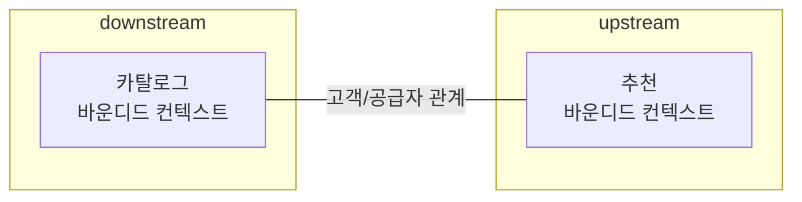
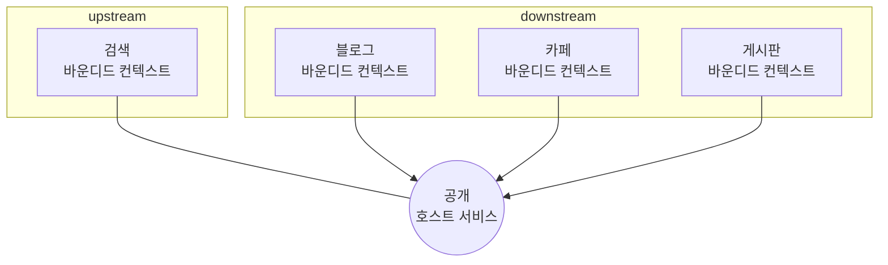
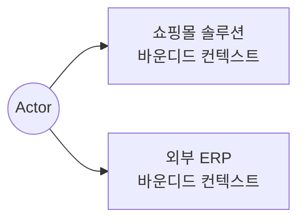
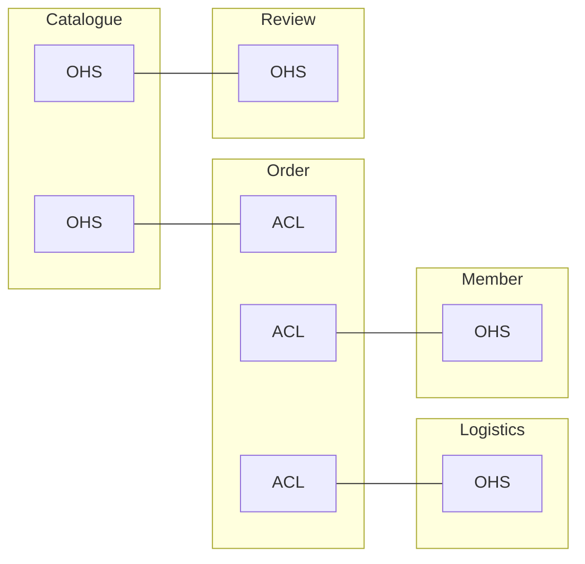

# Chapter 9 도메인 모델과 바운디드 컨텍스트

# 9.1 도메인 모델과 경계


[출처: 도메인 주도개발 시작하기 / 최범균]

- 하나의 도메인 모델로 여러 하위 도메인을 표현하려고 하면 모든 하위 도메인에 맞지 않는 모델을 만들게 된다.

|  | 카탈로그 컨텍스트 | 재고관리 컨텍스트 |
| --- | --- | --- |
| 상품 | - 상품 이미지 / 상품명 / 상품 가격 / 옵션목록 / 상세설명 | - 실제 상품 객체 추적 |
|  | - 상품으로 부른다. | - 문서로 부른다. |
- 하위 도메인마다 부르는 용어가 다르기 때문에 하위 도메인마다 모델을 만들어야 한다.
- 각 모델은 명시적으로 구분되는 경계가 명확해야 한다.
    - 서로 섞이기 시작하면 모델의 의미가 약해진다.
    - 하위 도메인별로 발생하는 새로운 요구사항을 반영하기 어려워진다.
    - 모델은 특정 컨텍스트 안에서 완전한 의미를 갖는다.

# 9.2 바운디드 컨텍스트

- 바운디드 컨텍스트는 **모델의 경계**를 결정하며, **논리적인 단일 모델**을 갖는다.
- 바운디드 컨텍스트는 용어를 기준으로 구분한다.
- 바운디드 컨텍스트와 하위 도메인이 항상 1:1 관계를 갖지 않는다.
    - 기업의 조직구조 → 같은 컨텍스트를 다른 조직에서 운영

      

      [출처: 도메인 주도개발 시작하기 / 최범균]

    - 규모가 작은 기업 → 서로 다른 컨텍스트를 하나의 조직에서 운영

      

      [출처: 도메인 주도개발 시작하기 / 최범균]

- 하나의 바운디드 컨텍스트로 여러 하위 도메인을 관리할 때에는
    - 하위 도메인 모델이 섞이지 않도록 한다.
    - 하위 도메인마다 별도의 패키지를 갖도록 분리한다.

      

      [출처: 도메인 주도개발 시작하기 / 최범균]


# 9.3 바운디드 컨텍스트 구현

- 바운디드 컨텍스트는
    - 표현 + 응용 + 도메인 + 인프라 Layer 까지 포함한다.

      

      [출처: 도메인 주도개발 시작하기 / 최범균]

    - 도메인이 제공하는 기능이 단순하다면 도메인 주도로 개발하지 않아도 된다.

      

      [출처: 도메인 주도개발 시작하기 / 최범균]

    - 한 바운디드 컨텍스트 안에서 두 방식을 혼합할 수 있다.

      

      [출처: 도메인 주도개발 시작하기 / 최범균]

    - 각 바운디드 컨텍스트는 서로 다른 구현기술을 사용할 수 있다.
    - 각 바운디드 컨텍스트가 반드시 UI 를 갖을 필요는 없다.

      

      [출처: 도메인 주도개발 시작하기 / 최범균]

      

      [출처: 도메인 주도개발 시작하기 / 최범균]


# 9.4 바운디드 컨텍스트 간 통합

- 카탈로그 하위 도메인에 추천 기능을 도입한다면?
    - 사용자가 제품 상세 페이지를 볼 때 보고 있는 상품과 유사한 상품목록을 하단에 보여준다.

  

  [출처: 도메인 주도개발 시작하기 / 최범균]

    ```mermaid
    flowchart LR
        사용자-- 추천제품목록요청 --->카탈로그바운디드컨텍스트-- 추천정보조회 --->추천바운디드컨텍스트
    		추천바운디드컨텍스트-- 추천정보 --->카탈로그바운디드컨텍스트
    		카탈로그바운디드컨텍스트-- 추천제품목록 --->사용자
    ```


### REST API 연동(직접통합)

- **추천 바운디드 컨텍스트**는 추천 컨텍스트 중심의 도메인 모델을 제공한다.

    ```json
    [
    	{ "itemId": "PROD-1000", "type": "PRODUCT", "rank": 100 },
    	{ "itemId": "PROD-1001", "type": "PRODUCT", "rank": 54  }
    ]
    ```

- **카탈로그 바운디드 컨텍스트**는 추천 컨텍스트 중심의 도메인 모델을 받아 카탈로그 바운디드 컨텍스트 도메인 모델로 변환하여 표현한다.

    ```kotlin
    /**
    * 상품 추천 기능을 표현하는 도메인 서비스
    */
    interface ProductRecommendationService {
    	fun getRecommendationsOf(id: ProductId): List<Product>
    }
    ```

    - 도메인 서비스를 구현한 클래스(`RecSystemClient`)는 인프라스트럭처 영역에 위치한다.
        - 외부 시스템과의 연동을 처리하고, 카탈로그 바운디드 컨텍스트 도메인 모델로 변환하여 표현한다.

      

      [출처: 도메인 주도개발 시작하기 / 최범균]

        ```kotlin
        class RecSystemClient(
        	private val productRepository: ProductRepository,
        	private val externalRecClient: ExternalRecClient
        ) : ProductRecommendationService {
        
        	override fun getRecommendationsOf(id: ProductId): List<Product> = 
        		toProduct(getRecItems(id.value))
        
        	// externalRecClient 를 외부 추천시스템을 위한 client 로 가정
        	private fun getRecItems(itemId: String): List<RecommendationItem> = 
        		externalRecClient.getRecs(itemId)
        
        	private fun toProducts(items: List<RecommendationItem>): List<Product> = items.map { toProductId(it.itemId) }
        				  .map { productRepository.findById(it) }
        
        	private fun toProductId(itemId: String): ProductId 
        		= ProductId(itemId)
        }
        ```

      

      [출처: 도메인 주도개발 시작하기 / 최범균]


    ### MQ 연동(간접통합)
    
    
    
    [출처: 도메인 주도개발 시작하기 / 최범균]
    
    - **카탈로그 바운디드 컨텍스트**는 MQ 에 사용자 활동이력을 넣을 때 카탈로그 바운디드 컨텍스트 중심의 데이터 구조를 따라 넣는다.
    - **추천 바운디드 컨텍스트**는 MQ 로부터 **카탈로그 바운디드 컨텍스트** 중심의 사용자 활동이력을 가져와 **추천 바운디드 컨텍스트** 중심의 모델로 변환하여 표현한다.
        
        
        
        
        
        
        [출처: 도메인 주도개발 시작하기 / 최범균]

- 어떤 도메인 관점에서 모델을 사용하느냐에 따라 두 바운디드 컨텍스트의 구현코드가 달라진다.

  **카탈로그 도메인 모델 기준**

    ```kotlin
    // 상품조회 관련 로그 기록 코드
    class ViewLogService(private val messageClient: MessageClient) {
    	fun appendViewLog(memberId: String, productId: String, time: Date) {
    		messageClient.send(ViewLog(memberId, productId, time))
    	}
    }
    
    // messageClient
    class RabbitMQClient(private val rabbitTemplate: RabbitTemplate) 
    : MessageClient {
    	
    	override fun send(viewLog: ViewLog) {
    		// 카탈로그 기준으로 작성한 데이터를 큐에 그대로 보관
    		rabbitTemplate.convertAndSend(logQueName, viewLog)
    	}	
    }
    ```

  **추천 도메인 모델 기준**

    ```kotlin
    // 상품조회 관련 로그 기록 코드
    class ViewLogService(private val messageClient: MessageClient) {
    	fun appendViewLog(memberId: String, productId: String, time: Date) {
    		messageClient.send(ActivityLog(memberId, productId, time))
    	}
    }
    
    // messageClient
    class RabbitMQClient(private val rabbitTemplate: RabbitTemplate) 
    : MessageClient {
    	
    	override fun send(activityLog: ActivityLog) {
    		// 추천 도메인 기준으로 작성한 데이터를 큐에 그대로 보관
    		rabbitTemplate.convertAndSend(logQueName, activityLog)
    	}	
    }
    ```

  

  [출처: 도메인 주도개발 시작하기 / 최범균]


> **마이크로서비스와 바운디드 컨텍스트**
각 바운디드 컨텍스트는 모델의 경계를 형성하기 때문에 이것을 기준으로 MSA 를 구현하면 자연스럽게 컨텍스트별로 모델이 분리된다. ****
>

# 9.5 바운디드 컨텍스트 간 관계

- 바운디드 컨텍스트는 다양한 방법을 통해 서로 협력한다. → 의존성을 갖는다.



그림 9.17 고객/공급자 관계를 갖는 바운디드 컨텍스트 [출처: 도메인 주도개발 시작하기 / 최범균]

### 통합방식(협력)

- **카탈로그 바운디드 컨텍스트**는 **추천 바운디드 컨텍스트**가 제공하는 REST API 를 사용하여 기능을 제공한다. (의존관계, **카탈로그 바운디드 컨텍스트** → **추천 바운디드 컨텍스트**)
- **단점**
    - upstream 에서 REST API 를 변경하면 downstream 은 반드시 영향을 받는다. → downstream 생산성 저하 가능성
    - upstream 에서 REST API 변경이 어려워진다. → 변경 전 downstream 과 사전 협의 필수 → upstream 생산성 저하 가능성



- 검색 기능을 구현한 검색 시스템을 구축하고, 단일 API 를 통해 downstream 에서 검색 기능을 구현한다.
- **단점**
    - upstream 의 도메인 모델을 downstream 에서 따라간다.
    - downstream 에서는 반드시  upstream 도메인 모델을 downstream 도메인 모델로 변환하는 완충지대(**Anticorruption Layer**)가 반드시 필요하다.

      

      [출처: 도메인 주도개발 시작하기 / 최범균]


    | 통합 방식 | 장점 | 단점 |
    | --- | --- | --- |
    | 서로 다른 바운디드 컨텍스트 간 도메인 모델 통합 | 동일한 도메인 모델이 서로 다른 바운디드 컨텍스트 간에 중복이 없다. | 도메인 모델을 마음대로 변경할 수 없다. |
    |  |  |  upstream / downstream  간의 생산성 저하가 발생할 가능성이 높다.
     |
    | 서로 다른 바운디드 컨텍스트 간 도메인 모델 분리 | 도메인 모델 변경에 대해서 통합하는 경우보다 상대적으로 바운디드 컨텍스트 간에 크게 영향을 받지 않는다. | downstream 도메인 모델로 변환하는 완충지대(Anticorruption Layer)가 반드시 필요하다. |
    |  |  | 동일한 도메인 모델이 서로 다른 바운디드 컨텍스트 간에 중복이 발생한다. |

### 독립방식(SEPARATE)

- 서로 다른 두 바운디드 컨텍스트를 서로 완전히 분리한다. → 의존성 없음 → 서로 협력 안함



| 장점 | 단점 |
| --- | --- |
| 바운디드 컨텍스트 간 의존성이 없다. | 통합은 수동으로 해야한다. |
| 서로 다른 도메인 모델에 대해 변경이 용이하다. | 규모에 대해 한계가 있다. |

# 9.6 컨텍스트 맵

- 전체 비즈니스를(도메인) 볼 수 있는 지도의 역할을 한다.



그림 9.22 바운디드 컨텍스트 간 관계를 표시한 컨텍스트 맵 [출처: 도메인 주도개발 시작하기 / 최범균]

- **작성요건**
    - 각 바운디드 컨텍스트 간 경계가 명확하게 드러나야 한다.
    - 컨텍스트 간 관계가 드러나야 한다. → 주요 애그리거트 표시
    - 규칙은 정해진 것은 없지만, 위의 요건을 충분히 만족시켜야 한다.
