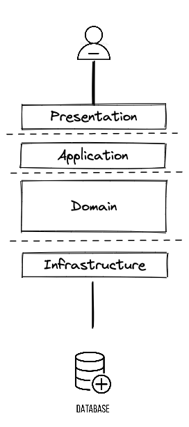

# 도메인이란 무엇인가?
 - 현실세계에 있는 것을 소프트웨어로 표현 하고자 한 것
 - 도메인은 하위 도메인을 포함 하기도 하는데 반드시 고정된 하위 도메인이 존재하는 것은 아니다.

# 도메인 전문가와 개발자간의 지식 공유
 - 현실에 있는 도메인을 소프트웨어로 표현하려면 어떻게 해야하는가?
   - 가장 간단한 방법으로 도메인 전문가와 직접 대화하여 요구사항을 이끌어 내는 것이다.
 - 원하는 제품을 정확히 만들기 위해서는 개발자 또한 도메인 지식을 갖추는 것이 좋다.
 - 도메인 지식공유를 통해 도메인 전문가가 자신이 원하는 요구사항이 무엇인지 정확하게 이끌어 낼 수 있다.
   - Garbage in Garbage out

# 도메인 모델
 - 도메인 자체를 이해하기 위해 개념적으로 표현한 모델
 - 도메인 모델을 이용하여 여러 사람들이 도메인 지식을 공유할 수 있다.
 - 도메인 모델의 구성 요소
   - 기능(행위)
   - 데이터 구성(상태)
 - 도메인 마다 다루는 영역이 서로 다르기 때문에 용어가 같을 지라도 의미가 다를 수 있다.
   - 의미가 다르기 때문에 여러 의미에 맞게 도메인을 표현하는 도메인 모델을 따로 만들어야 한다

# 도메인 모델 패턴
  
 - 흐름은 보통 위(Presentation) 에서 부터 아래(Infrastructure)로 흐르는 것을 기본으로 한다.
 - Presentation(표현)
   - 사용자의 요청을 받고(Request), 검증(Validation), 응답(Response) 하는 역할
 - Application(응용)
   - 도메인을 조합하여 기능을 실행하는 부분
 - Domain
   - 도메인 전문가와 협업하여 이끌어낸 요구사항이 담기는 부분
 - Infrastructure
   - 외부 시스템과의 연동을 담당하는 부분
