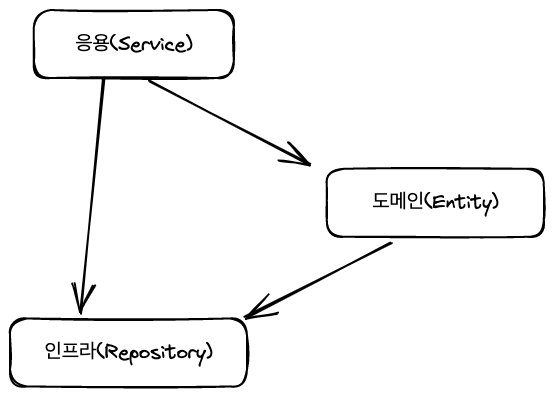
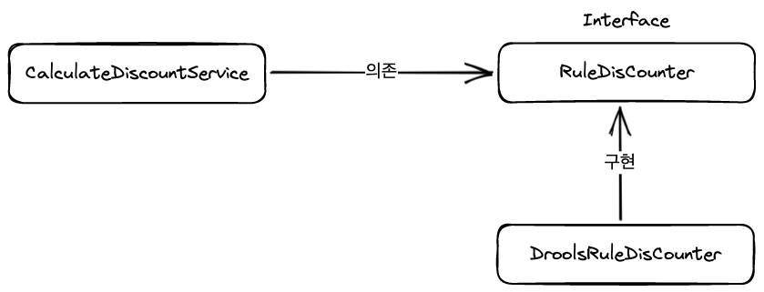
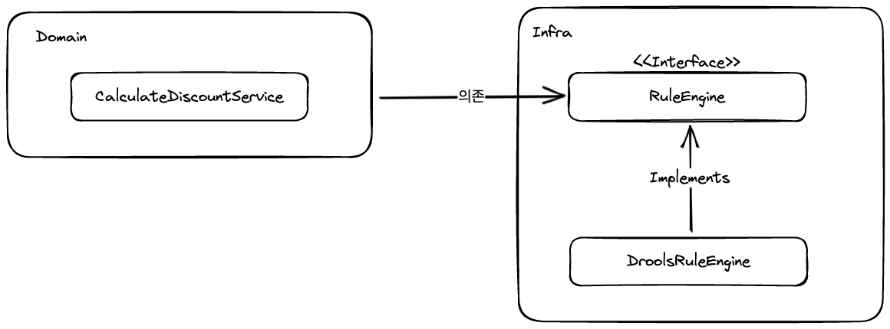
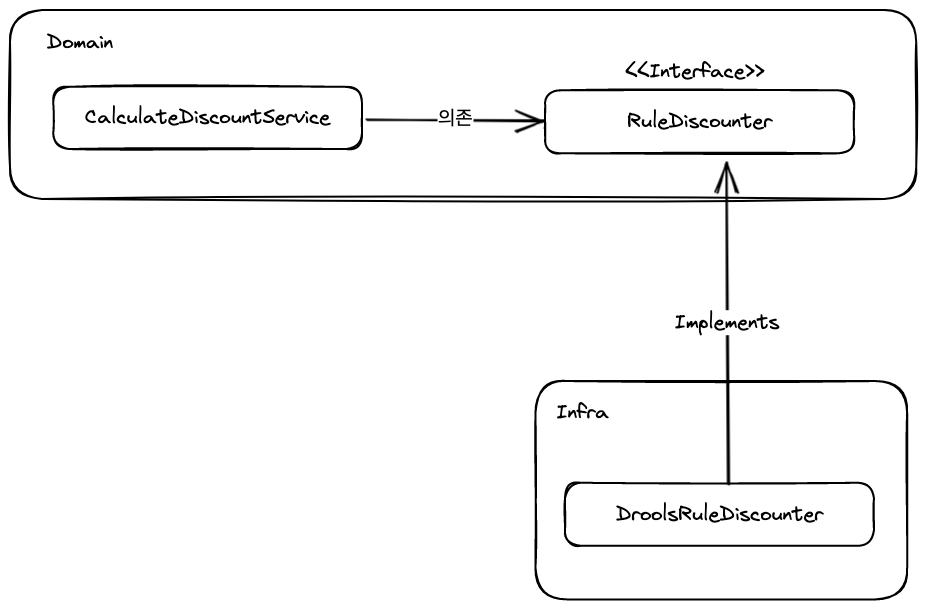
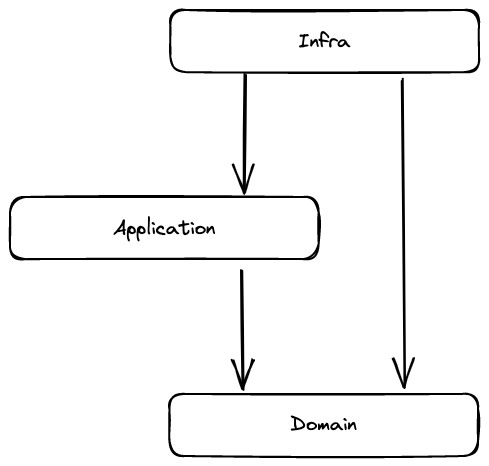

# 2.1 네개의 영역(표현, 응용, 도메인, 인프라스트럭처 영역)
 - 표현 영역(Presentation)
   - 웹 애플리케이션이라면 HTTP 요청을 받아 응용 영역이 필요로 하는 형식으로 변환하고 응용 영역에서 처리한 데이터를 다시 HTTP 응답으로 변환 한다
   - 요청에 대한 검증 한다
 - 응용 영역(Application)
   - 도메인 모델에 있는 기능을 사용하여 비즈니스를 처리한다
   - 영속화 된 데이터를 가져오기 위해 인프라스트럭처 영역을 의존하기도 한다
 - 도메인 영역(Domain)
   - 엔티티나 값 객체를 갖는다
   - 비즈니스를 처리하는 핵심 로직은 도메인 영역안에 들어있다
 - 인프라스트럭처 영역(Infrastructure)
   - 다른 레이어에서 필요로 하는 실제 구현에 대한 것들을 지원한다
     - ex> 영속화 되어있는 데이터 가져오기, 다른 웹 애플리케이션에 REST API 요청 보내기
   - 논리적인 개념을 표현하기 보다는 실제 구현 기술을 사용하는 목적이 더 크다

# 2.2 계층 구조 아키텍처
 
 
  - 계층 구조의 특성상 상위 계층에서 하위 계층으로의 의존만 존재하고 하위에서 상위로 의존하지 않는다
  - 계층 구조를 엄격하게 적용한다면 상위 계층은 바로 아래 계층에만 의존을 가져야 하지만 구현의 편리함을 위해 계층 구조를 유연하게 적용하기도 한다

```java
public class DroolsRuleEngine {
   private KieContainer kieContainer;

   public DroolsRuleEngine() {
      KieService ks = KieService.Factory.get();
      kContainer = ks.getKieClasspathContainer();
   }

   public void evalute(String sessionName, List<?> facts) {
      ...
   }
}

public class CalculateDiscountService {
   private DroolsRuleEngine ruleEngine;

   public CalculateDiscountService() {
      ruleEngine = new DroolsRuleEngine();
   }

   public Money calculateDiscount(List<OrderLine> orderLines, String customerId) {
      Customer customer = findCustomer(customerId);

      // Drools에 특화된 코드
	  MutableMoney money = new MutableMoney(0);
      List<?> facts = Arrays.asList(customer, money);
      facts.addAll(orderLines);
      ruleEngine.evalute("discountCalculation", facts);
      // Drools에 특화된 코드
      
      return money.toImmutableMoney();
   }
}
```
계층 구조 아키텍처의 응용 계층은 인프라 계층에 의존적이게 되는데 그 예시를 보여준 코드이다
위 코드는 2가지 문제점을 갖는다
 - 응용 계층의 서비스가 인프라 계층의 구현체에 직접적으로 의존하고 있어서 **테스트 하기 어렵다**
   - CalculateDiscountService를 테스트 하기 위해선 DroolsRuleEngine가 정상적으로 동작해야 한다
 - DroolsRuleEngine 이 아닌 다른 Engine 구현체를 써야할때 **변경이 어렵다**

이 2가지 문제를 해결하려면 DIP 원칙을 적용하면 된다


# 2.3 DIP
 DIP는 의존관계 역전 원칙으로 저수준 모듈은 고수준 모듈에 의존해야 한다는 원칙이다
 - 고수준 모듈: 의미 있는 단일 기능을 제공하는 모듈
 - 저수준 모듈: 하위 기능을 실제로 구현한 모듈
 - 직접적으로 구현 클래스에 의존하지 않고 인터페이스에 의존하라는 말
 - 그 기능을 표현하는 추상화된 인터페이스에 의존해야 한다는 말

예를 들어 고객 정보를 구하고 룰을 적용해서 할인 금액을 구한 다음 가격 할인 계산을 한다는 로직이 있을때 **가격 할인 계산**은 고수준 모듈이 되고 가격 할인 계산 하기 위해
**고객 정보를 구하고 룰을 적용**해야 하는 부분은 저수준 모듈(하위 기능)이 된다

앞의 코드 예시에 DIP를 적용한다면 이런 구조가 된다


```java
public interface RuleDiscounter {
   Money applyRules(Customer customer, List<OrderLine> orderLines);
}

public class DroolsRuleDiscounter implements RuleDiscounter {
   private KieContainer kieContainer;

   public DroolsRuleDiscounter() {
      KieService ks = KieService.Factory.get();
      kContainer = ks.getKieClasspathContainer();
   }

   @Override
   public Money applyRules(Customer customer, List<OrderLine> orderLines) {
      // DroolsEngine 특화 코드
   }
}

public class CalculateDiscountService {
   private RuleDiscounter ruleDiscounter;

   public CalculateDiscountService(RuleDiscounter ruleDiscounter) {
      ruleDiscounter = ruleDiscounter;
   }

   public Money calculateDiscount(List<OrderLine> orderLines, String customerId) {
      Customer customer = findCustomer(customerId);
      return ruleDiscounter.applyRules(customer, orderLines);
   }
}
```

코드를 보면 서비스는 더 이상 적집적으로 구현 기술에 의존하지 않고 있다.
대신 **룰을 적용한다** 는 인터페이스에 의존하고 있다 서비스 입장에서 구체적으로 어떤 룰을 적용할지는 관심사항이 아니다 단지 서비스가 관심있는건 룰을 적용한다에만 관심이 있다

앞에서 DIP를 적용 한다면 테스트의 어려움, 변경의 어려움을 해결 할 수 있다고 하였는데 어떤 방식으로 해결하는지도 살펴보자
 - CalculateDiscountService가 RuleDiscounter 인터페이스에 의존적이기 때문에 RuleDiscounter를 구현하는 다른 객체를 주입하는 방식으로 변경의 어려움을 해결 할 수 있다
```java
// 새로운 룰 생성
RuleDiscountr simpleRuleDiscounter = new SimpleRuleDiscounter();

// DroolsRuleDiscounter 대신 새로운 룰을 사용
CalculateDiscountService calculateDiscounteService = new CalculateDiscountService(simpleRuleDiscounter);
```
 - CalculateDiscountService가 저수준 구현체를 직접적으로 의존한다면 저수준 구현체가 완성되기 전까지는 테스트 할 수 없다 인터페이스를 의존함으로써 대역 객체를 이용하여 테스트를 할 수 있다

```java
public class CalculateDiscountServiceTest {
	
	@Test
    public void noCustomer_thenExceptionShouldBeThrown() {
		// 테스트를 위한 대역 객체
        // given
        RuleDiscounter stub = (cust, lines) -> null;
		
		// 대역 객체 주입 받아 테스트
        // when
        CalculateDiscountService calculateDiscountService = new CalculateDiscountService(stub);
		
		// then
        assertThrows(NoCustomerException.class, () -> calculateDiscountService.calculateDiscount(lines, customerId));
    }
}
```

## 2.3.1 DIP 주의사항 
단순히 인터페이스와 구현 클래스의 분리로서 DIP가 적용되었다고 볼 수 없다. 
DIP를 적용할때 저수준 관점에서 인터페이스를 생성하고 그 인터페이스를 구현한 구현 클래스를 도메인이 의존하는 형태로 설계한다면 DIP를 잘못 적용 한 것이다.


CalculateDiscountService 입장에서는 룰 엔진을 사용한다는 것은 중요하지 않고 단지 규칙을 적용한채로 할인 금액을 계산 하는것이 중요하다.


DIP를 적용하여 추상화 인터페이스를 만들때에는 고수준 모듈 관점에서 추상화를 도출 해야한다

## 2.3.2 과 DIP와 아키텍처
인프라 영역은 구현 기술을 다루는 저수준 모듈이고 응용 영역과 도메인 영역은 고수준 모듈이다
계층형 구조에서는 인프라 영역이 가장 하단에 위치하지만 DIP를 적용하면 인프라 영역이 응용 영역과 도메인 영역에 의존(상속)하는 구조가 된다

> DIP를 항상 적용 할 필요는 없다.
> 구현 기술에 의존적인 코드를 도메인에 일부 포함하는게 효과적일 때도 있다.
> 또는 추상화 대상이 떠오르지 않을 때도 있다.
> 무조건 DIP를 적용한다기 보다는 DIP의 이점을 얻는 수준에서 적용 범위를 검토해 보자.

# 2.4 도메인 영역의 주요 구성요소
 - 엔티티
 - 밸류
 - 애그리거트
 - 리포지터리
 - 도메인 서비스: 특정 엔티티에 속하지 않은 도메인 로직을 말한다. 도메인 로직이 여러 엔티티와 밸류를 필요로 하면 도메인 서비스에서 로직을 구현한다

## 2.4.1 엔티티와 밸류(도메인 모델의 엔티티와 DB 모델의 엔티티의 차이점)
 - 도메인 모델의 엔티티는 데이터와 함께 도메인 기능을 함께 제공하며 DB 모델의 엔티티는 단순히 데이터만을 담고 있다
   - 도메인 모델의 엔티티가 기능을 제공함으로써 도메인 관점에서 기능을 구현하고 캡슐화 하기 때문에 임의로 데이터가 변경되는 것을 막는다
 - 도메인 모델의 엔티티는 두 개 이상의 데이터를 개념적 하나인 경우를 표현할 수 있다 -> 밸류 타입

## 2.4.2 애그리거트
도메인이 커질수록 개발할 도메인 모델도 커지면서 많은 엔티티와 밸류가 출현한다. 엔티티와 밸류가 많아질수록 모델은 점점 복잡해진다
이렇게 도메인이 커질수록 모델은 복잡해지게 되는데 복잡해진 모델의 전체 구조를 이해하는데 도움이 되는 것이 **애그리거트**이다

애그리거트는 도메인과 관련되어있는 객체를 하나로 묶어주는 역할을 하는데 대표적인 예로 주문을 들수있다
주문이라는 도메인 개념은 '주문(Order)', '배송지 정보(ShippingInfo)', '주문자(Orderer)', '주문 목록(OrderLine)', '총 결제 금액(Money)'의 하위 모델로 구성된다

 - 애그리거트를 사용하게되면 관련 객체를 묶어서 객체 군집 단위로 모델을 바라볼 수 있게 된다
 - 애그리거트는 군집에 속한 객체를 관리하는 루트 엔티티를 갖게되는데 애그리거트를 사용하는 코드는 이 루트가 제공하는 기능을 실행하고 루트를 통해 간접적으로 애그리거트 내의 다른 엔티티나 밸류에 접근한다
   - 이렇게 하는 이유는 애그리거트의 내부 구현을 숨겨서 애그리거트 단위로 캡슐화 할 수 있게 돕기 위함이다
 - **결국 애그리거트를 어떻게 구성했느냐에 따라 구현이 복잡해지기도 하고, 트랜잭션 범위가 달라지기도 한다 또한 구현 기술에 따라 애그리거트 구현에 제약이 생기기도 한다**

## 2.4.3 리포지터리
 - 도메인 객체를 지속적으로 사용하기 위해 RDBMS와 같은 물리적인 저장소에 도메인 객체를 보관해야한다.(영속화) 이를 위한 도메인 모델이 리포지터리이다.
 - 리포지터리는 애그리거트 단위로 도메인 객체를 저장하고 조회하는 기능을 정의한다
```java
public interface OrderRepository {
	Order findByNumber(OrderNumber orderNumber);
	void save(Order order);
    void delete(Order order);
}
```
 - 리포지터리는 도메인 모델 관점에서 도메인 객체를 영속화하는데 필요한 기능을 추상화한 인터페이스는 고수준 모듈에 속하며 도메인 영역에 속한다
   - 이를 구현한 클래스는 저수준 모듈이 되고 인프라 영역에 속한다
