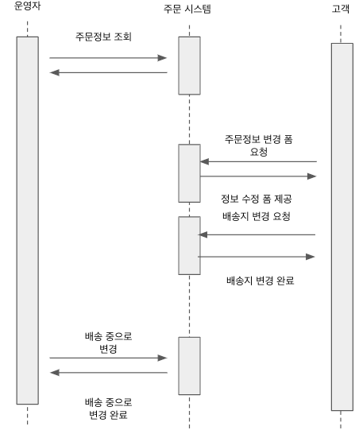
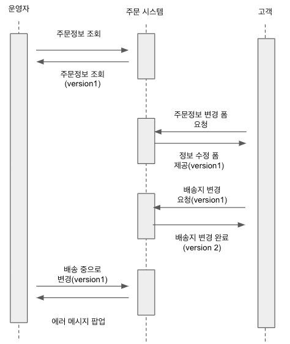

## 8.1 애그리거트와 트랜잭션

- 서로 다른 트랜잭션에서 동일안 애그리거트 인스턴스를 동시에 수정하면 어떻게 될까?
- 상품 배송지를 변경하는 트랜잭션과 상품 배송상태를 변경하는 트랜잭션을 동시에 실행하면 아래와 같다.


- 두 트랜잭션은 동일한 애그리거트를 수정하면서 일관성을 유지하지 못한다.
- 문제를 해결하는 방법
  - 운영자가 배송상태를 변경하는 동안 수정하지 못하도록 제한한다
  - 고객이 정보를 변경하는 동안 운영자가 애그리거트르 다시 읽어서 변경하도록 한다.
- DBMS 에서의 트랜잭션을 제어하는 기법과 함께 추가적인 애그리거트의 처리기법이 필요하다.


## 8.2 선점 잠금

1. 배송 변경 요청 스레드가 애그리거트를 먼저 선점하고 잠군다.
2. 배송지 변경 스레드는 애그리거트에 접근을 시도하지만 잠겨있기 때문에 대기(blocking)한다.
3. 배송 변경 요청 스레드가 애그리거트를 수정하고 잠금을 해제한다.
4. 배송지 변경 스레드는 애그리거트에 접근을 할 수 있게 된다.
5. 배송지 변경은 애그리거트를 가져오고 다시 한번 잠군다.
6. 애그리거트를 수정후 잠금을 해제한다.

배송지 변경 스레드는 이미 배송중으로 바뀐 주문을 접근했을 때에는 도메인 규칙으로 인해 '배송지를 변경할 수 없습니다.' 같은 안내 메시지를 전달 받는다.

### 선점 잠금이란
- 선점 잠금은 간단히 설명하자면 하나의 트랜잭션이 끝날 때가지 다른 트랜잭션에 접근은 블로킹시켜 잠구는 방법이다.
- 선점 잠금은 DBMS가 행단위 잠금을 사용해서 구현을 하게 된다. 
- 특정 레코드에 한 커넥션만 접근하도록 잠금장치를 건다. 

### 선점 잠근 구현
엔티티 메니저를 통한 구현
```java
Order order = entityManger.find(Order.class, orderId, LockModeType.PESSIMISTIC_WRITE);
```
Lock어노테이션을 활용한 구현
```java
public interface OrderRepository extends JpaRepository<Order, Long> {
    @Lock(LockModeType.PESSIMISTIC_WRITE)
    Optional<Order> findById(Long orderId);
}
```
### 선점 잠금과 교착상태
- 선점 잠금은 교착상태를 발생시킬 수 있다. 이점을 유의하여 구현해야 한다.
- 서로 다른 스레드에서 동일하게 사용되는 애그리거트를 잠금을 걸어서 사용하게 되면 교착상태가 발생할 수 있다.
  - 스레드1: 주문 애그리거트 선점 잠금 구함
  - 스레드2: 재고 애그리거트 선점 잠금 구함
  - 스레드1: 재고 애그리거트 선점 잠금 시도
  - 스레드2: 주문 애그리거트 선점 잠금 시도
- 이렇게 된다면 스레드1에서 재고 애그리거트를 선점 잠금을 시도하기 위해 대기하게 되고 잠금되어 있떤 스레드2에서는 주문 애그리거트를 선점 잠금을 시도하기 위해 대기하게 된다.
- 이런 상황에서는 두 스레드 모두 무한정 대기하게 되고 교착상태가 발생하게 된다.
- 이러한 교착상태는 보통 사용자가 많아질 때 발생할 확률이 높고 교착상태에 빠진 스레드가 많아지게 된다.
- 교착상태를 푸는 방법은 다음과 같이 힌트를 사용해 Exception을 발생시키는 방법이 있다.
```java
Map<String, Object> hints = new HashMap<>();
hints.put("javax.persistence.lock.timeout", 0);
Order order = entityManger.find(Order.class, orderId, LockModeType.PESSIMISTIC_WRITE, hints);
```
```java
public interface OrderRepository extends JpaRepository<Order, Long> {
    @Lock(LockModeType.PESSIMISTIC_WRITE)
    @QueryHints({@QueryHint(name = "javax.persistence.lock.timeout", value = "0")})
    Optional<Order> findById(Long orderId);
}
```
- JPA에서의 잠금은 위와같은 쿼리힌트를 통해 잠금을 하는 시간을 밀리초 단위로 설정할 수 있다.
- DBMS에 따라 지원하지 않을 수도 있으니 해당 기능을 제공하는지 확인해보고 사용을 권장한다.
- DBMS마다 교착상태를 처리하는 방식이 다르다. 커넥션 단위로 대기시간을 설정하는 DBMS와 쿼리단위로 대기시간을 설정하는 DBMS도 있기 때문에 잘 알아봐야한다.

### 느낀점 
- 애그리거트와 트랜잭션의 관계는 매우 밀접한 관계를 가지고 있다. 하나의 트랜잭션의 동작해야될 뿐만 아니라 다른 스레드에서의 일관성을 해칠수 있는 부분을 고려해야한다.
- 도메인 지식을 깊은 수준을 가지고 있지 않는다면 교착상태가 발생할 수 있는 상황을 잘 파악하지 못할 수 있을 것 같다. 

## 8.3 비선점 잠금
- 선점잠금은 강력한 기능을 제공하지만 모든 트랜잭션의 문제를 해결할 수는 없다.
- 아래와 같은 상황을 예시로 들면 이해하기 쉽다.


1. 운영자는 배송을 위해 주문 정보를 조회한다. 시스템은 주문 정보를 제공한다.
2. 그사이에 고객이 주문 변경 폼을 요청하고 주문을 변경한다.
3. 운영자는 1번에서 주문한 정보를 보고 배송중으로 변경한다.

### 선점 잠금의 문제점
- 운영자는 고객이 변경한 주문 정보를 모른채 배송중으로 변경했다. 고객은 배송정보를 변경했음에도 불구하고 엉뚱한 곳으로 배송이 되게 된다.
- 이런 문제는 선점잠금 방식으로 해결할 수 없다. 선점잠금은 다른 시간에 일어나는 애그리거트의 일관성까지 보장해주지는 않는다.
- 비선점 잠금은 동시에 접근하는 것을 막는 대신에 DBMS 에 반영하는 

```sql
update order set version = version +1 where id = 1 and version = 1;
```



- 위와 같이 동일한 버전일 때에만 수정하고 다른 버전일 경우 수정하지 못하도록 한다.
- 이렇게 되면 다른 트랜잭션이 먼저 데이터를 수정하게 되어 버전 값이 바뀌면 운영자의 트랜잭션은 실패하게 된다.
- JPA에서는 아래와 같은 어노테이션을 통해 버전을 관리할 수 있다.
```java
@Entity
public class Order {
    @Version
    private Long version;
}
```
```sql
update order set version = version +1 where id = 1 and version = 1;
```
- 응용서비스는 버전을 관리하는 것을 알 필요가 없다. JPA에서 트랜잭션 종료시점에 실행해주기 때문이다.
- 하지만 프레임워크에서 제공하는 Exception이 아닌 직접 Exception을 만들어서 처리해야 한다면 아래와 같이 버전을 체크하여 확인하면 된다.
```java
public class OrderService {
  @Transactional
  public void updateOrder(Long orderId, OrderUpdateRequest request) {
    Order order = orderRepository.findById(orderId).orElseThrow(() -> new OrderNotFoundException(orderId));
    
    // 버전 체크
    if (order.getVersion() != request.getVersion()) {
      throw new OrderVersionException(orderId);
    }
    order.update(request);
    orderRepository.save(order);
  }
}
```
### 강제 버전 증가
- 애그리거트 루트가 아닌 다른 경로를 통해 연관된 엔티티의 값이 변경될 수 있다.
- 다른 루트를 통해 변경되었기 때문에 JPA 에서는 버전을 증가시키지 않는다. 
- 애그리거트의 관점으로 봤을 때에는 루트엔티티를 통해 바뀌지 않았더라도 구성요소의 일부가 변경되었기 때문에 버전이 증가해야 한다.
- 이런 경우에는 강제 버전 증가를 통해 해결할 수 있다.
```java
public class JpaOrderRepository {
    @Override
    public void findByIdOptimisticLockMode(Order order) {
        return entityManager.find(Order.class, order.getId(), LockModeType.OPTIMISTIC_FORCE_INCREMENT);
    }
}
```
- LockModeType.OPTIMISTIC_FORCE_INCREMENT 를 통해 엔티티가 변경되었는지 상ㅇ관 없이 트랜잭션 종료시점에 버전 값을 증가한다. 
- 이 잠금모드를 사용하게 되면 다른 엔티티와 벨류가 변경되더라도 버전값을 증가시킬 수 있으므로 비선점을 사용할 수 있다.
- 스프링 데이터 JPA를 사용하면 @Lock 어노테이션을 통해 지정할 수 있따.