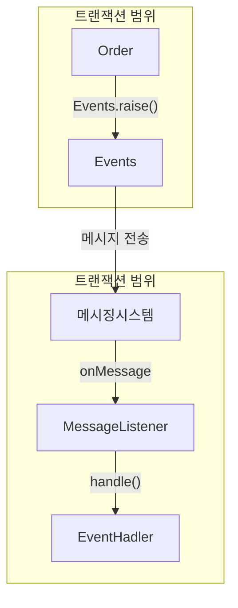
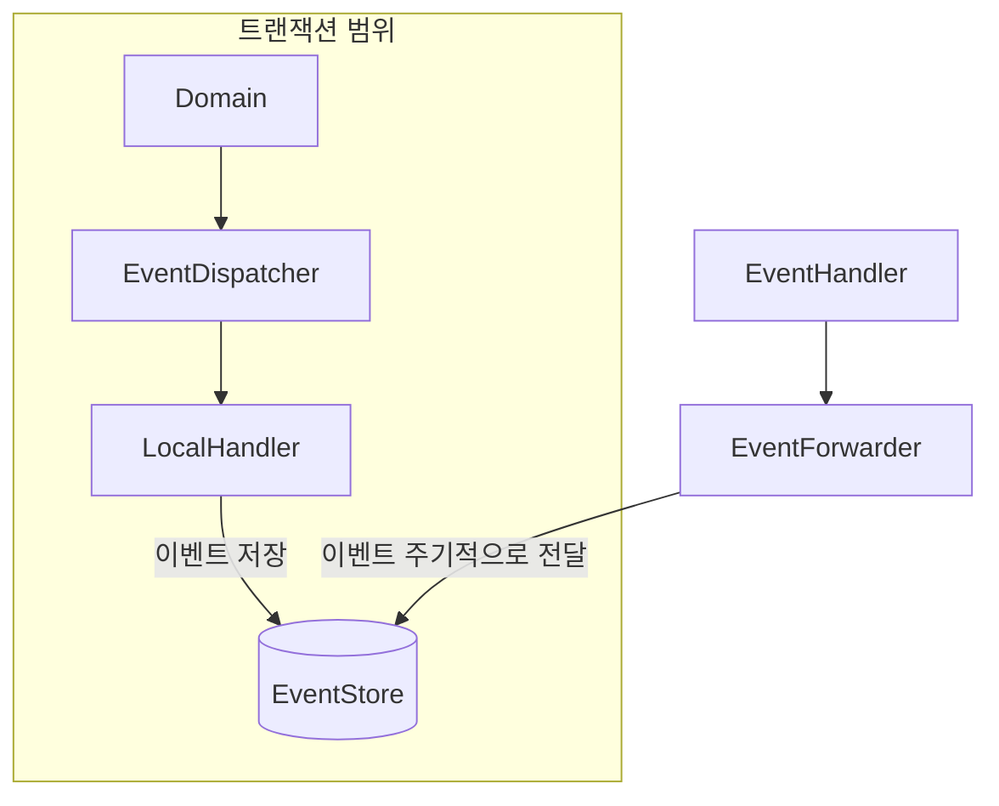
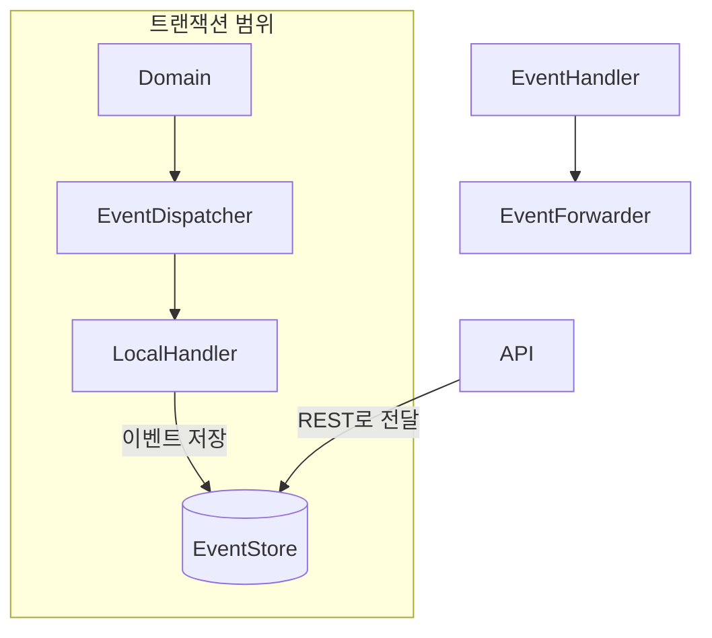
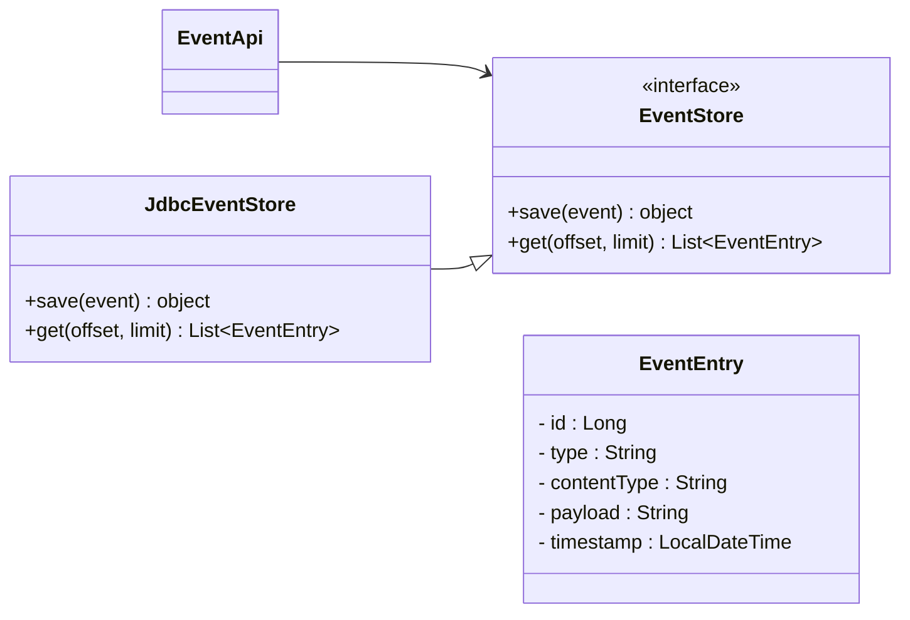

## 10.4 동기 이벤트 처리 문제

- 이벤트를 사용하여 강결합 문제는 해결했지만 외부서비스에 영향을 받는 것은 여전하다.

```java
public class OrderService {
    // 외부 연동과정에서 예외가 발생한다면 트랜잭션 처리는?
    public void cancel(OrderNo orderNo) {
        Order order = findOrder(orderNo);
        order.cancel(); // cancel 상태로 저장하는데 ㅣException이 발생할 수 있다.
        orderRepository.save(order); 
    }
}
```

```java

@Service
public class OrderCanceledEventHandler {
    @EventListener(OrderCanceledEvent.class)
    public void handle(OrderCanceledEvent event) {
        // 환불이 늦어지거나 예외가 발생한다면 cancel 메서드도 같이 영향을 받게 된다.
        refundService.refund(event.getOrderNo());
    }
}
```
- 외부 서비스로 인해 시스템까지 영향을 받는다. 
- 성능 저하뿐만 아니라 트랜잭션도 문제가 된다. 환불을 실패했으니 롤백해야될까? 트랜잭션을 롤백하면 구매취소가 실패하는 것과 같다.
- 이런 문제를 처리할 때 비동기로 처리하거나 이벤트와 트랜잭션을 연계하는 방법으로 해결할 수 있다.

## 10.5 비동기 이벤트 처리
- 회원가입시 이메일을 발송하는 경우를 생각해보자. 이메일 검증이 반드시 같은 트랜잭션을 통해 처리되어 할 필요가 없다.
- 10초뒤 전달되도 되고 전달받지 못했을시 다시 전달해도 된다. 주문도 마찬가지로 바로 환불할 필요는 없다.
- 수십초 뒤에 결제 취소를 해도 되고 몇일이 지나도 된다.

### 요구사항 파악하기
- A를 하면 B를 하라의 요구사항은 보통 A를 하면 B를 언제까지 한다. 라는 형태로 나타나는 경우가 많다.
- B의 처리가 실패하면 다시 시도하거나 수동으로 처리한다. 회사, 개발팀 룰마다 다르다.
- A를 하면 최대까지 B를 한다의 요구사항이라면 언제든지 할 수 있다.

### 비동기 이벤트 처리 방법
- 로컬 핸들러 비동기로 실행
- 메시지 큐를 통한 비동기 처리
- 이벤트 저장소와 이벤트 포워더 사용
- 이벤트 저장소와 이벤트 제공 API 사용

### **로컬 핸들러 비동기 실행
- 스프링에서 손쉽게 비동기를 처리할 수 있도록 지원해준다. 이벤트를 아래의 설정만 하게되면 비동기로 처리할 수 있다.

**비동기 이벤트 처리 설정**
- @EnableAsync 어노테이션을 붙여서 비동기 처리를 활성화한다.

```java
@EnubleAsync
@SpringBootApplication
public class ShoppingApplication {
    public static void main(String[] args) {
        SpringApplication.run(ShoppingApplication.class, args);
    }
}
```
- 이벤트 핸들러의 메서드에 @Async 어노테이션을 붙여주면 된다.
```java
@Service
public class OrderCanceledEventHandler {
    @EventListener(OrderCanceledEvent.class)
    @Async
    public void handle(OrderCanceledEvent event) {
        refundService.refund(event.getOrderNo());
    }
}
```
**주의점**
- private method는 사용 불가
- self-invocation(자가 호출) 불가, 즉 inner method는 사용 불가
- QueueCapacity 초과 요청에 대한 비동기 method 호출시 방어 코드 작성

### 메시징 시스템을 통해 비동기 처리
- 카프카나 RabbitMQ 같은 메시징 시스템을 사용하여 비동기 처리를 할 수 있다.

1. 이벤트를 메시지 큐에 보낸다.
2. 메시지 큐는 메시지 리스너에게 메시지를 전달한다.
3. 메시지 리스너는 알맞는 이벤트 핸들러를 찾아서 실행한다.
> 이벤트를 메시지 큐에 전달하는 과정과 메시지 큐에서 메시지를 꺼내서 이벤트 핸들러를 실행하는 과정은 별도의 프로세스 또는 스레드에서 실행된다.

### 글로벌 트랜잭션
- 필요에 따라서 이벤트를 발생시키는 도메인 기능과 이벤트를 처리하는 절차를 하나의 트랜잭션으로 묶을 상황이 있다.
- 도메인 기능을 실행한 결과를 DB에 반영하고 발생한 이벤트를 메시지 큐에 전달하는 과정을 하나의 트랜잭션으로 묶어야 할 때에는
글로벌 트랜잭션을 사용하면 된다.
- 글로벌 트랜잭션을 사용하면 안전하게 메시지큐에 이벤트를 전달할 수 있다.

### 글로벌 트랜잭션의 단점
- 단점은 글로벌 트랜잭션을 사용하면 전체 성능이 떨어진다.
- 메시지 큐를 사용하게 된다면 보통 이벤트 발생 주체와 이벤트 처리 주체가 별도 프로세스에 동작한다.
- 이것은 서로 다른 JVM에서 동작하게 되는 것을 의미한다. 물론 하나의 JVM에서 동작하게 할 수도 있지만
이러한 구조는 시스템 디자인을 복잡하게 만들고, 테스트하기 어렵게 만든다.

### 메시징 시스템의 장단점
- RabbitMQ와 같은 글로벌 트랜잭션 지원과 클러스터와 고가용성을 지원하기 때문에 안정적으로 사용할 수 있다.
- 카프카는 글로벌 트랜잭션을 지원하지 않는다. 다른 메시징 시스템에 비해 빠른 성능을 자랑한다.


## 10.5.3 이벤트 저장소를 이용한 비동기 처리
- 일단 이벤트를 발생시키면 이벤트를 저장소에 저장하고, 별도의 프로그램을 통해 이벤트 핸들러로 전달하는 방법이 있다.

### 포워더로 처리

이방식은 도메인의 상태변화와 이벤트가 로컬 트랜잭션으로 처리된다. 이벤트를 저장하므로 실패시 다시 불러와서 실행하면 된다. 
1. 이벤트가 발생하면 이벤트 스토리지에 저장
2. 포워더가 이벤트를 주기적으로 가져와서 이벤트 핸들러에 전달(별도의 스레드로 동작하여 이벤트가 비동기처리)

### 외부 API 로 처리


### 차이점 비교
- 포워더 방식은 포워더를 통해 이벤트를 전달하지만 API 방식은 외부 핸들러가 API 서버를 통해 이벤트를 전달받는다.

### 이벤트 저장소의 구현 방법

- EventEntry: 이벤트 저장소에 저장할 이벤트 정보를 담는 클래스
- EventStore: 이벤트 저장소 인터페이스
- JdbcEventStore: 이벤트 저장소 구현체
- EventApi: Rest API를 통해 이벤트 목록을 제공하는 컨트롤러

**EventEntry**
```java
/**
 * 이벤트 객체를 직렬화하여 payload에 저장한다. json 형식으로 저장하면 contentType은 application/json으로 설정한다.
 */
@Getter
public class EventEntry {
    private Long id;
    private String type;
    private String contentType;
    private String payload;
    private LocalDateTime timestamp;
}
```

**EventStore**
```java
/**
 * 이벤트는 과거에 발생한 이벤트 이므로 수정 기능을 제공하지 않는다.
 */
public interface EventStore {
    EventEntry save(EventEntry event);
    List<EventEntry> get(long offset, int limit);
}
```


**JdbcEventStore**
```java
 public class JdbcEventStore implements EventStore {
    private final JdbcTemplate jdbcTemplate;
    private final ObjectMapper objectMapper;

    public JdbcEventStore(JdbcTemplate jdbcTemplate, ObjectMapper objectMapper) {
        this.jdbcTemplate = jdbcTemplate;
        this.objectMapper = objectMapper;
    }

    @Override
    public EventEntry save(EventEntry event) {
        KeyHolder keyHolder = new GeneratedKeyHolder();
        jdbcTemplate.update(connection -> {
            PreparedStatement ps = connection.prepareStatement(
                    "insert into event (type, content_type, payload, timestamp) values (?, ?, ?, ?)",
                    Statement.RETURN_GENERATED_KEYS);
            ps.setString(1, event.getType());
            ps.setString(2, event.getContentType());
            ps.setString(3, event.getPayload());
            ps.setObject(4, event.getTimestamp());
            return ps;
        }, keyHolder);
        event.setId(keyHolder.getKey().longValue());
        return event;
    }

    @Override
    public List<EventEntry> get(long offset, int limit) {
        return jdbcTemplate.query(
                "select id, type, content_type, payload, timestamp from event order by id limit ? offset ?",
                (rs, rowNum) -> {
                    EventEntry event = new EventEntry();
                    event.setId(rs.getLong("id"));
                    event.setType(rs.getString("type"));
                    event.setContentType(rs.getString("content_type"));
                    event.setPayload(rs.getString("payload"));
                    event.setTimestamp(rs.getObject("timestamp", LocalDateTime.class));
                    return event;
                }, limit, offset);
    }
}
```

**EventHandler**
```java
public class EventHandler {
    private final EventStore eventStore;
    
    @EventListener(Event.class)
    public void handle(Event event) {
        eventStore.save(new EventEntry(event));
    }
}
```

**EventApi**
```java
@RestController
@RequestMapping("/api/events")
public class EventApi {
    private final EventStore eventStore;

    public EventApi(EventStore eventStore) {
        this.eventStore = eventStore;
    }

    @GetMapping
    public List<EventEntry> getEvents(@RequestParam(defaultValue = "0") long offset,
                                      @RequestParam(defaultValue = "20") int limit) {
        return eventStore.get(offset, limit);
    }
}
```
**응답 결과**
```json
[
    {
        "id": 1,
        "type": "OrderCreated",
        "contentType": "application/json",
        "payload": "{\"id\":1,\"productId\":1,\"quantity\":1,\"price\":1000,\"createdAt\":\"2021-07-26T15:00:00\"}",
        "timestamp": "2021-07-26T15:00:00"
    },
    {
        "id": 2,
        "type": "OrderCreated",
        "contentType": "application/json",
        "payload": "{\"id\":2,\"productId\":2,\"quantity\":2,\"price\":2000,\"createdAt\":\"2021-07-26T15:00:00\"}",
        "timestamp": "2021-07-26T15:00:00"
    }
]
```
### 클라이언트의 동작 과정
1. 가장 마지막에 처리한 데이터의 lastOffset을 저장한다.
2. 마지막으로 처리한 데이터의 lastOffset을 기준으로 이벤트를 가져온다.
3. 가져온 이벤트를 처리한다.
4. 이벤트를 처리한 후 lastOffset을 업데이트한다.

### 포워더의 구현 
```java
public class EventForwarder {
    private EventStore eventStore;
    private OffsetStore offsetStore;
    private EventSender eventSender;
    private int limitSize = DEFAULT_LIMIT_SIZE;
    
    @Scheduled(fixedDelay = 1000)
    public void getAndSend() {
        // 1. 마지막으로 처리한 데이터의 lastOffset을 가져온다.
        long lastOffset = getLastOffset();
        // 2. 마지막으로 처리한 데이터의 lastOffset을 기준으로 limitSize 만큼 이벤트를 가져온다.
        List<EventEntry> events = eventStore.get(lastOffset, limitSize);
        // 3. 가져온 이벤트가 존재하는지 체크
        if (!events.isEmpty()) {
            // 4. 이벤트를 처리한 후 lastOffset을 업데이트한다.
            int processedCount = sendEvent(events);
            if (processedCount > 0) {
                updateLastOffset(lastOffset + processedCount);
            }
        }
    }
    
    private long getLastOffset() {
        return offsetStore.getLastOffset();
    }
    
    private int sendEvent(List<EventEntry> events) {
        int processedCount = 0;
        try {
            for (EventEntry event : events) {
                eventSender.send(event);
                processedCount++;
            }
        } catch (Exception e) {
            log.error("send event error", e);   
        }
        return processedCount;
    }
    
    private void updateLastOffset(long lastOffset) {
        offsetStore.updateLastOffset(lastOffset);
    }
}
```
**OffsetStore**
- 마지막으로 처리한 데이터의 lastOffset을 저장하는 저장소
```java
public interface OffsetStore {
    long getLastOffset();
    void updateLastOffset(long lastOffset);
}
```

**EventSender**
- 이벤트를 전송하는 인터페이스
```java
public interface EventSender {
    void send(EventEntry event);
}
```

### auto increment시 주의사항
- id 값은 insert 시점에 생성되지만 반영은 commit 시점에 반영된다.
- 즉 auto increment 통해 id가 증가했더라도 증가한 record가 commit 되지 않은 상태라면 해당 id를 조회할 수 없다.
- 예를 들어 id가 1인 상태에서 2개의 트랜잭션이 insert를 수행했을 때 후발 트랜잭션이 먼저 커밋 되면서 id가 3인 record가 commit 되었다고 가정하자.
- 이 사이에 조회하여 lastOffset을 가져오게 되면 3이 되고 2는 누락된다.
- 이를 해결하기 위해 id를 기준으로 지연 조회하는 방식을 사용해야 한다. 
