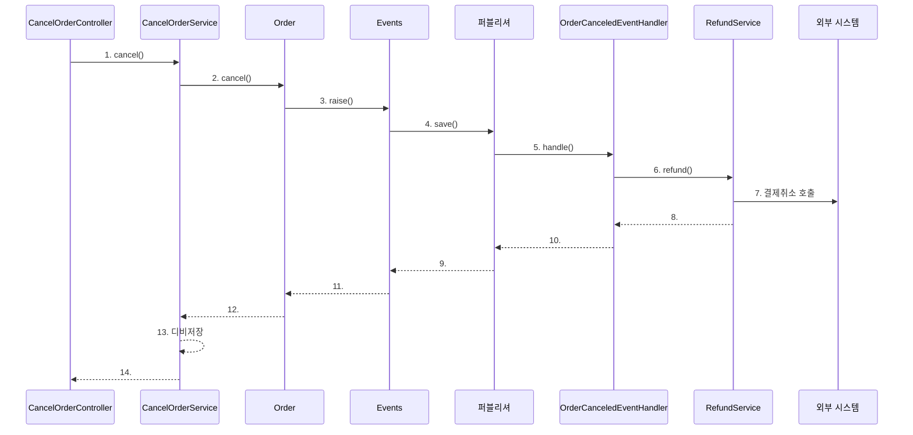
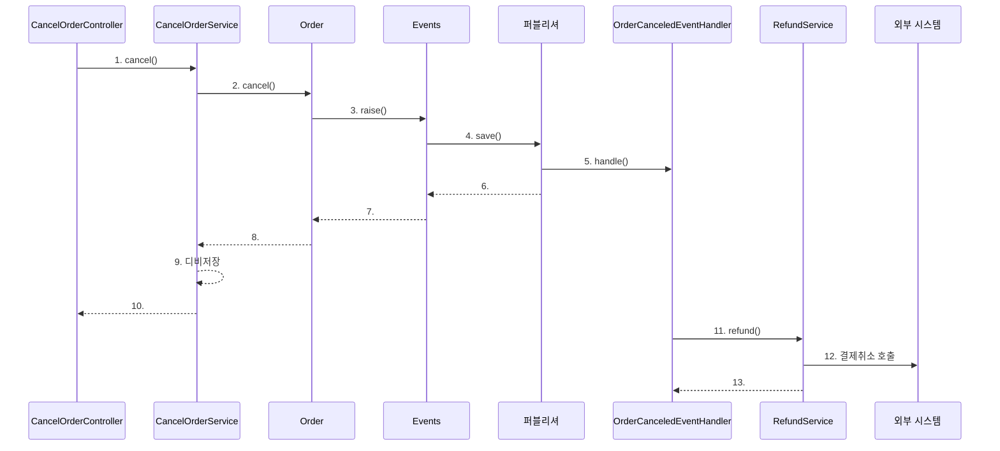

## 10.6 이벤트 적용시 고려사항
- 이벤트 소스를 EventEntry에 추가할지 여부
- 특정 주체에 발생시킨 이벤트를 조회하는 기능을 추가한다면 이벤트 발생 주체 정보를 추가해야된다.
- 포워더에서 전송 실패를 얼마나 허용할 지 결정해야한다.
  - 전송 실패시 이벤트를 재전송할지 여부
  - 얼마나 재전송 할지 결정해야할지 여부
- 이벤트 손실
  - 비동기로 처리했을 때 이벤트의 생성과 처리는 따로 발생
- 이벤트 순서
  - 이벤트 발생 순서에 따라 이벤트를 처리해야하는 경우가 있다.
  - 이벤트를 순서대로 처리하려면 이벤트를 발생시킨 도메인에서 이벤트를 발생시킨 순서를 기록해야한다. 그래서 이벤트 저장소를 사용해야한다.
  - 메시징 시스템은 사용 기술에 따라 메시지 순서가 다를 수 있다.
- 이벤트 재처리
  - 동일한 이벤트 발생시 어떻게 이벤트를 처리할지 결정해야한다.
  - 가장 쉬운 방법은 이미 처리한 이벤트가 다시 발생했을 때 기억해두었다가 무시한다.

> 멱등성  
> 연산을 여러번 적용해도 결과가 달라지지 않는 성질을 말한다. 이벤트 처리도 동일한 이벤트를 여러번 처리해도 시스템이 같은 상태가 되도록 구현 가능하다.
> 예시로 배송지 변경하는 이벤트는 여러번 처리해도 결과적으로 동일 주소 값을 가지게 된다. 이벤트 핸들러가 명등성을 가지면 이벤트의 중복발생이나 중복처리에 대한 
> 부담을 더뤄줌

### 10.6.1 이벤트 처리와 DB 트랜 잭션 고려
- 주문 취소 기능은 주문취소이벤트 발생
- 주문 취소 이벤트 핸들러는 환불 서비스 호출하여 환불 처리
- 환불 서비스는 외부 API 호출하여 환불처리


**문제점**
- 환불처리까지 완료된 상태에서 주문 상태를 변경하지 못한 경우에는 문제가 발생한다.
- 이러한 문제점은 비동기로 처리해도 문제가 발생한다. 
- 외부 API를 호출하는 것이 실패한다면 주문은 취소완료 상태로 바뀌었지만 결제는 취소되지 않은 상태인 것이다.
- 이벤트를 동기하든 비동기하든 이벤트 처리 실패와 트랜잭션 실패를 고려해야한다. 
- 모든 실패를 고려하면 복잡해지므로 트랜잭션이 처리되었을 때 이벤트 핸들러를 실행하는 것이 좋다.


**해결하는 방법**
- 스프링에서 제공하는 @TransactionalEventListener를 사용하면 트랜잭션의 상태에 따라 이벤트 핸들러를 실행할 수 있다.
- 아래에는 트랜잭션이 커밋된 후에 이벤트 핸들러를 실행하도록 설정한 예제이다.
```java
public class OrderCanceledEvent {
    
  @TransactionalEventListener(
          classes = OrderCanceledEvent.class,
          phase = TransactionPhase.AFTER_COMMIT
  )
  public void handle(OrderCanceledEvent event) {
    refundService.refund(event.getOrderId());
  }
  
}
```
- 이벤트 저장소를 활용
- 이벤트 발생 코드와 이벤트 저장 처리를 하나의 트랜잭션으로 처리하면 이벤트 저장이 실패하면 트랜잭션도 롤백된다.