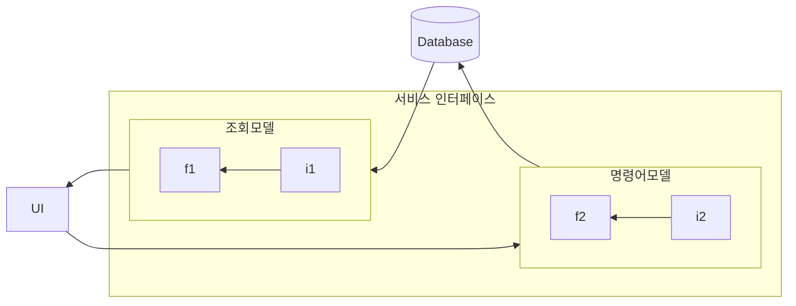
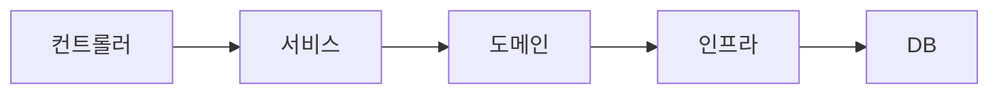
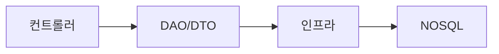

## 11.1 단일 모델의 단점
- 도메인 모델을 통해 도메인을 표현하고 도메인 로직을 구현하는 데에는 적합하다.
- 하지만 주문 상세 조회 화면처럼 여러 애그리거트에서 데이터를 조회해야 하는 경우에는 단일 모델이 적합하지 않다.
- 여러 애그리거트에서 데이터를 가져오는 것은 고려할 것이 많아서 구현을 복잡하게 만든다.

### 11.2 CQRS
- 시스템이 제공하는 기능은 크게 상태를 변경하는 기능과 상태 정보를 조회하는 기능으로 나눌 수 있다.
- CQRS(Command Query Responsibility Segregation)는 명령과 쿼리를 분리하는 패턴이다.
- CQRS는 복잡한 도메인에 적합하다. 도메인이 복잡할 수록 명령기능과 조회기능이 다루는 데이터 범위가 차이가 난다.
- CQRS를 통해 각 모델에 맞는 구현 기술을 선택할 수 있다.
- 조회성능을 위해 다른 저장소를 사용할 수 있다.
  - 이벤트를 활용하여 조회모델을 동기화 (단점: 전체적인 처리량, 처리속도가 느려질 수 있다.)
  - 특정 시간에 동기화. (단점: 데이터가 실시간으로 반영되지 않는다.)

**명령 모델**

**조회 모델**

### 11.2.1 웹과 CQRS
- 웹서비스는 보통 데이터를 처리하는 요청보다 데이터를 조회하는 요청이 더 많다.
- 알게모르게 CQRS 패턴을 사용하고 있다.
- 조회용 모델을 사용하고 있다면 명시적으로 구분하는 것이 복잡성을 낮출 수 있다.
### 예시
- 조회 전용 쿼리
- 조회 전용 저장소
- 캐시 저장소

### 장단점
- 장점
  - 도메인 모델에 대한 설계에만 집중할 수 있다.
  - 도메인 모델에 조회 관련 로직이 사라져 복잡도를 낮춘다.
  - 조회 성능을 향상시키는데 유라하다.
  - 조회 모델의 변경이 도메인 모델에 영향을 주지 않는다.
- 단점
  - 구현해야할 코드가 늘어난다. 현재 트래픽과 도메인을 잘 고려해보고 적용해야 한다.
  - 더 많은 구현 기술을 사용해야 한다.
    - 저장소가 분리될 경우 도메인 모델과 조회 모델의 동기화가 필요하다.
    - 동기화를 위한 메시징 시스템 구현 등

## 정리
- CQRS는 도메인의 복잡성을 낮추기 위한 패턴이다. 
- 도메인 모델과 조회 모델을 분리하여 구현한다.
- CQRS도 결국 트레이트 오프이다. 유지보수하기 좋은 방향으로 잘 선택해야한다.
- 도메인이 단순하고 트래픽이 많지 않은 경우 도메인 모델을 사용해도 무관하다. 